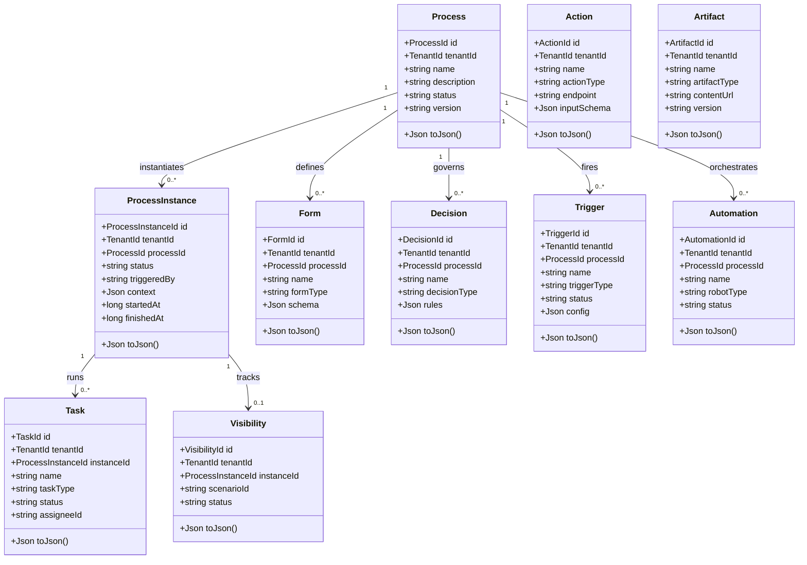
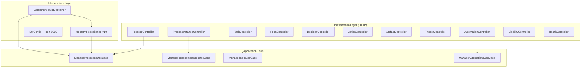
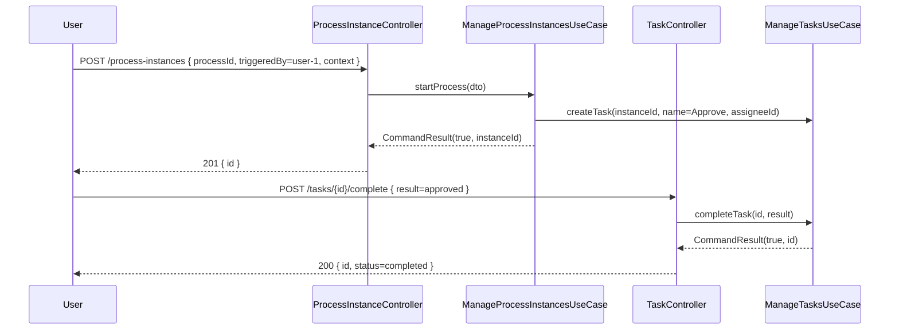

# UML — Process Automation Service

## Class Diagram — Domain Entities

```mermaid
classDiagram
    class Process {
        +ProcessId id
        +TenantId tenantId
        +string name
        +string description
        +string status
        +string version
        +Json toJson()
    }
    class ProcessInstance {
        +ProcessInstanceId id
        +TenantId tenantId
        +ProcessId processId
        +string status
        +string triggeredBy
        +Json context
        +long startedAt
        +long finishedAt
        +Json toJson()
    }
    class Task {
        +TaskId id
        +TenantId tenantId
        +ProcessInstanceId instanceId
        +string name
        +string taskType
        +string status
        +string assigneeId
        +Json toJson()
    }
    class Form {
        +FormId id
        +TenantId tenantId
        +ProcessId processId
        +string name
        +string formType
        +Json schema
        +Json toJson()
    }
    class Decision {
        +DecisionId id
        +TenantId tenantId
        +ProcessId processId
        +string name
        +string decisionType
        +Json rules
        +Json toJson()
    }
    class Action {
        +ActionId id
        +TenantId tenantId
        +string name
        +string actionType
        +string endpoint
        +Json inputSchema
        +Json toJson()
    }
    class Artifact {
        +ArtifactId id
        +TenantId tenantId
        +string name
        +string artifactType
        +string contentUrl
        +string version
        +Json toJson()
    }
    class Trigger {
        +TriggerId id
        +TenantId tenantId
        +ProcessId processId
        +string name
        +string triggerType
        +string status
        +Json config
        +Json toJson()
    }
    class Automation {
        +AutomationId id
        +TenantId tenantId
        +ProcessId processId
        +string name
        +string robotType
        +string status
        +Json toJson()
    }
    class Visibility {
        +VisibilityId id
        +TenantId tenantId
        +ProcessInstanceId instanceId
        +string scenarioId
        +string status
        +Json toJson()
    }

    Process "1" --> "0..*" ProcessInstance : instantiates
    Process "1" --> "0..*" Form : defines
    Process "1" --> "0..*" Decision : governs
    Process "1" --> "0..*" Trigger : fires
    Process "1" --> "0..*" Automation : orchestrates
    ProcessInstance "1" --> "0..*" Task : runs
    ProcessInstance "1" --> "0..1" Visibility : tracks
```

---

## Component Diagram

```mermaid
flowchart TB
    subgraph Presentation["Presentation Layer (HTTP)"]
        C1[ProcessController]
        C2[ProcessInstanceController]
        C3[TaskController]
        C4[FormController]
        C5[DecisionController]
        C6[ActionController]
        C7[ArtifactController]
        C8[TriggerController]
        C9[AutomationController]
        C10[VisibilityController]
        HC[HealthController]
    end
    subgraph Application["Application Layer"]
        UC1[ManageProcessesUseCase]
        UC2[ManageProcessInstancesUseCase]
        UC3[ManageTasksUseCase]
        UC4[ManageAutomationsUseCase]
    end
    subgraph Infrastructure["Infrastructure Layer"]
        MEM[Memory Repositories ×10]
        CFG[SrvConfig — port 8099]
        CTR[Container / buildContainer]
    end
    C1 --> UC1
    C2 --> UC2
    C3 --> UC3
    C9 --> UC4
    MEM --> UC1
    CTR --> UC1
    CTR --> MEM
```

---

## Sequence Diagram — Start Process and Complete Task

```mermaid
sequenceDiagram
    participant User
    participant PIC as ProcessInstanceController
    participant PIUC as ManageProcessInstancesUseCase
    participant TC as TaskController
    participant TUC as ManageTasksUseCase

    User->>PIC: POST /process-instances { processId, triggeredBy=user-1, context }
    PIC->>PIUC: startProcess(dto)
    PIUC->>TUC: createTask(instanceId, name=Approve, assigneeId)
    PIUC-->>PIC: CommandResult(true, instanceId)
    PIC-->>User: 201 { id }

    User->>TC: POST /tasks/{id}/complete { result=approved }
    TC->>TUC: completeTask(id, result)
    TUC-->>TC: CommandResult(true, id)
    TC-->>User: 200 { id, status=completed }
```
