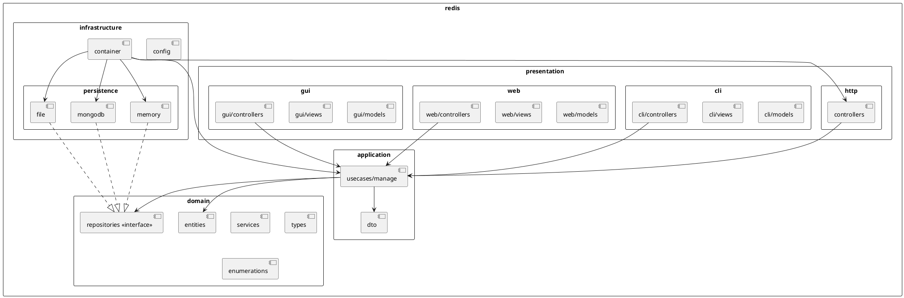
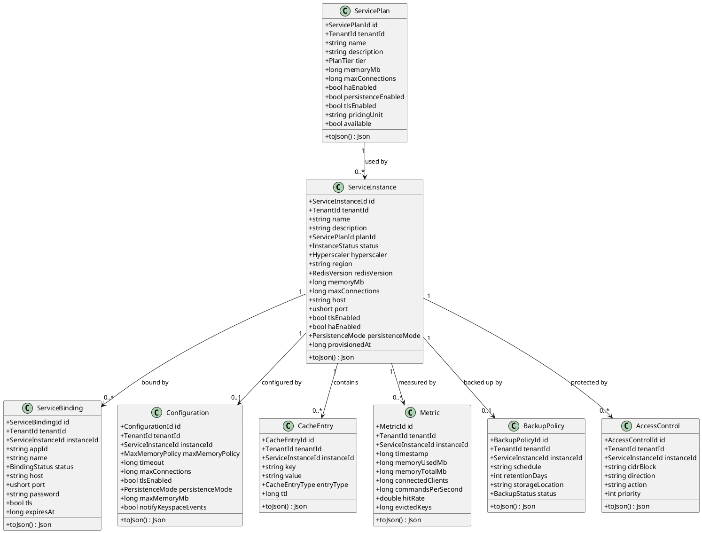
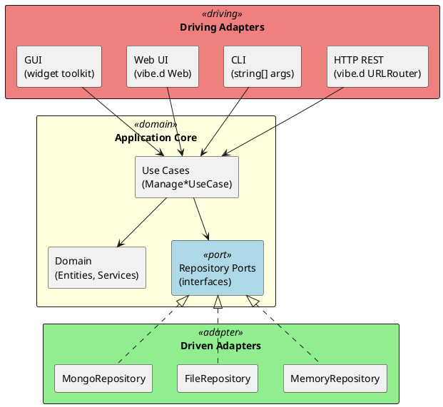
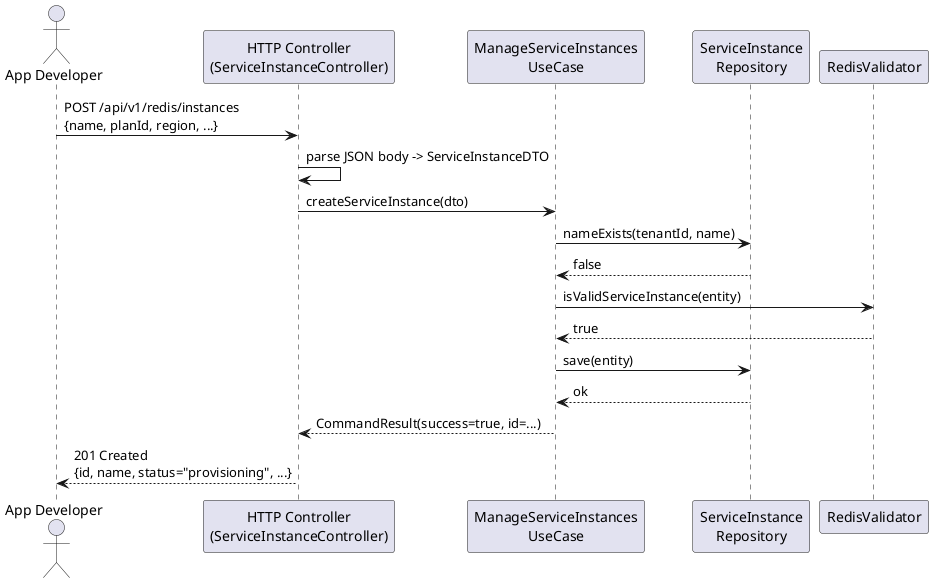
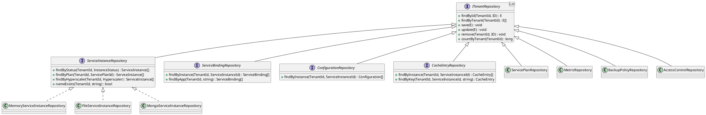
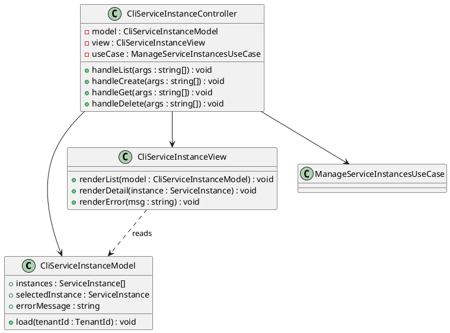
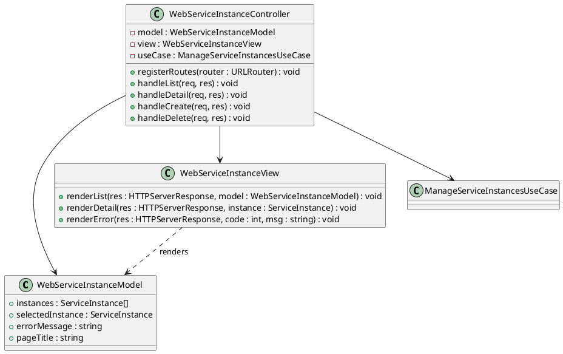
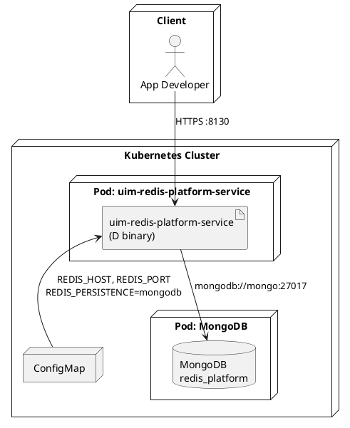

# UML — Redis on SAP BTP, Hyperscaler Option

All diagrams use **PlantUML** notation.

---

## 1. Package Overview (Component Diagram)

---

## 2. Domain Class Diagram

---

## 3. Hexagonal Architecture (Port & Adapter)

---

## 4. Use Case Sequence: Provision Service Instance

---

## 5. Repository Interface Hierarchy

---

## 6. CLI MVC Pattern

---

## 7. Web MVC Pattern

---

## 8. Deployment Diagram

