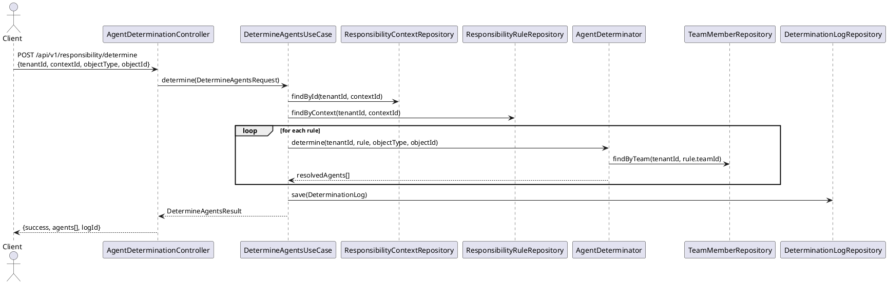
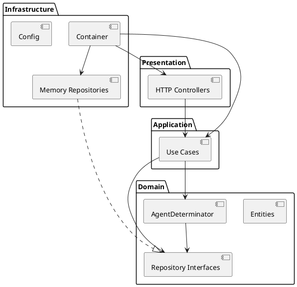

# UML — Responsibility Management Service

## Domain Model (Class Diagram)

```plantuml
@startuml

package "Domain" {

  class ResponsibilityRule {
    + ruleId: ResponsibilityRuleId
    + tenantId: TenantId
    + name: string
    + description: string
    + ruleType: RuleType
    + status: RuleStatus
    + expression: string
    + priority: int
    + contextId: string
    + teamId: string
  }

  class TeamCategory {
    + categoryId: TeamCategoryId
    + tenantId: TenantId
    + name: string
    + code: string
    + description: string
  }

  class TeamType {
    + typeId: TeamTypeId
    + tenantId: TenantId
    + name: string
    + code: string
    + categoryId: string
  }

  class Team {
    + teamId: TeamId
    + tenantId: TenantId
    + name: string
    + teamTypeId: string
    + categoryId: string
    + status: TeamStatus
    + scope_: AssignmentScope
    + memberIds: string[]
  }

  class TeamMember {
    + memberId: TeamMemberId
    + tenantId: TenantId
    + teamId: string
    + userId: string
    + email: string
    + displayName: string
    + functionId: string
    + role: MemberRole
    + validFrom: string
    + validTo: string
  }

  class MemberFunction {
    + functionId: MemberFunctionId
    + tenantId: TenantId
    + name: string
    + code: string
    + status: FunctionStatus
  }

  class ResponsibilityContext {
    + contextId: ResponsibilityContextId
    + tenantId: TenantId
    + name: string
    + objectType: string
    + namespace_: string
    + status: ContextStatus
    + ruleIds: string[]
  }

  class ResponsibilityDefinition {
    + definitionId: ResponsibilityDefinitionId
    + tenantId: TenantId
    + name: string
    + contextId: string
    + ruleId: string
    + teamId: string
    + status: DefinitionStatus
    + scope_: AssignmentScope
    + validFrom: string
    + validTo: string
    + functionIds: string[]
  }

  class DeterminationLog {
    + logId: DeterminationLogId
    + tenantId: TenantId
    + contextId: string
    + ruleId: string
    + objectType: string
    + objectId: string
    + status: DeterminationStatus
    + resolvedAgents: string[]
    + errorMessage: string
    + callerApp: string
    + executionTimeMs: long
  }

  enum RuleType { directAssignment, businessRule, teamBased, hierarchical }
  enum RuleStatus { active, inactive, draft }
  enum TeamStatus { active, inactive, archived }
  enum MemberRole { responsible, accountable, consulted, informed }
  enum FunctionStatus { active, inactive }
  enum ContextStatus { active, inactive }
  enum DeterminationStatus { success, noAgentFound, error }
  enum AssignmentScope { global_, regional, site }
  enum DefinitionStatus { active, inactive }

  ResponsibilityRule --> RuleType
  ResponsibilityRule --> RuleStatus
  Team --> TeamStatus
  Team --> AssignmentScope
  TeamMember --> MemberRole
  MemberFunction --> FunctionStatus
  ResponsibilityContext --> ContextStatus
  ResponsibilityDefinition --> DefinitionStatus
  ResponsibilityDefinition --> AssignmentScope
  DeterminationLog --> DeterminationStatus

  Team "1" --> "0..*" TeamMember : has members
  TeamType --> TeamCategory : belongs to
  Team --> TeamType : typed by
  ResponsibilityContext --> ResponsibilityRule : uses
  ResponsibilityDefinition --> ResponsibilityContext : bound to
  ResponsibilityDefinition --> ResponsibilityRule : applies
  ResponsibilityDefinition --> Team : assigns
}

@enduml
```

## Sequence Diagram — Agent Determination



## Component Diagram


