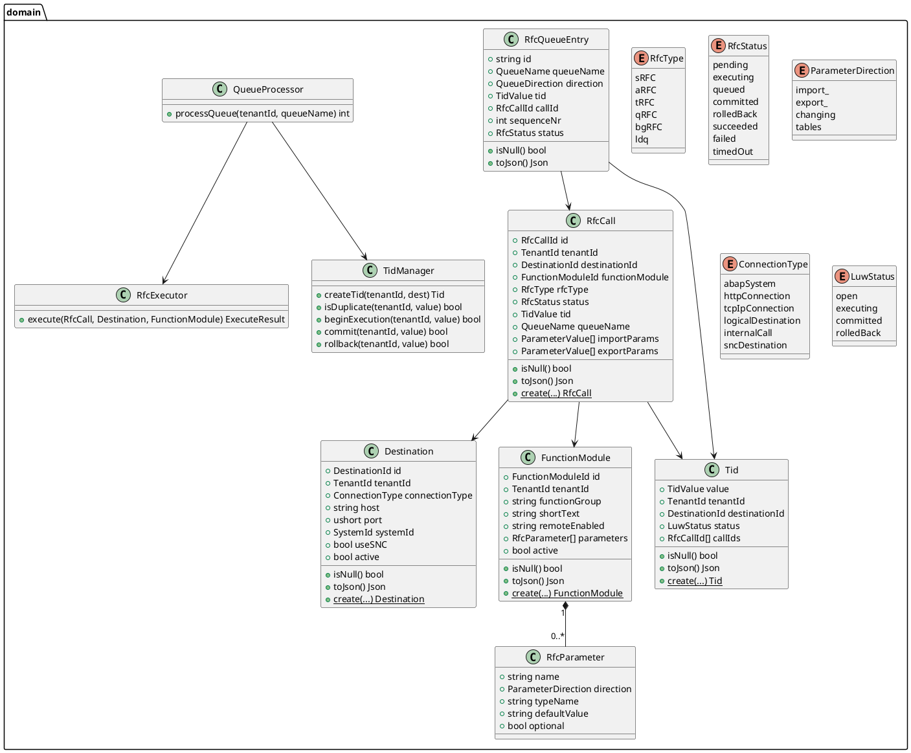
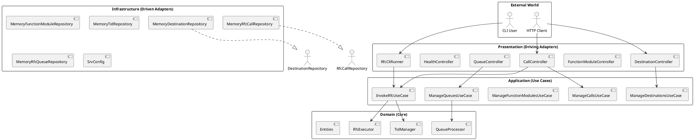
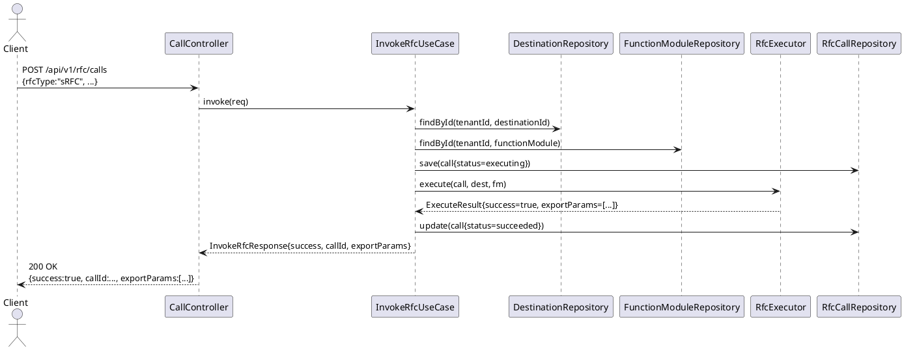
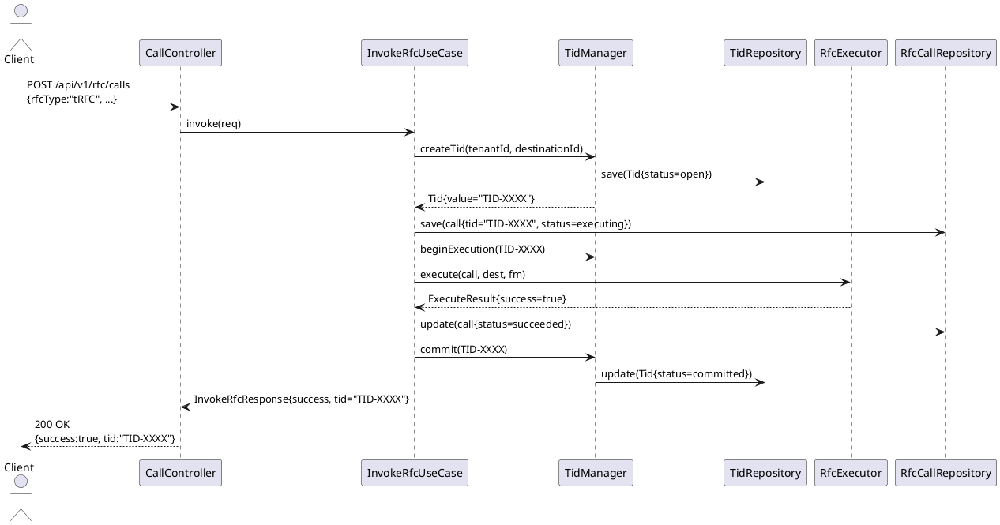
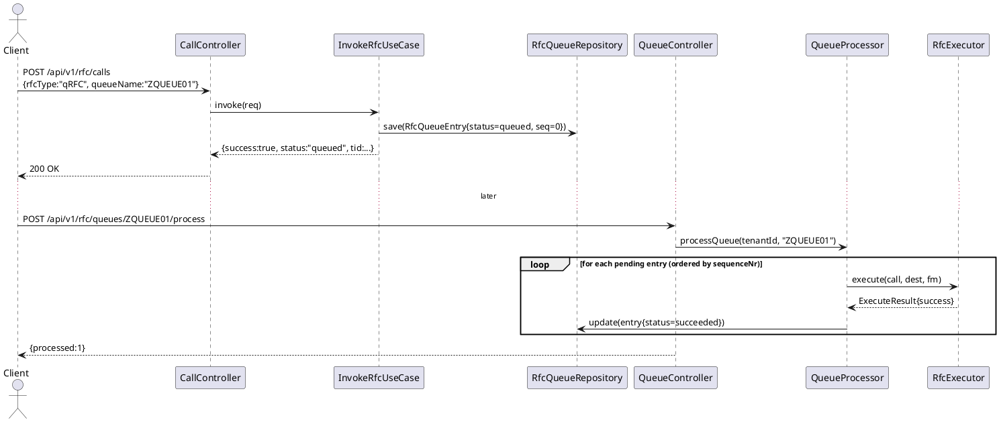

# UIM RFC Interface — UML Diagrams

## 1. Domain Model (Class Diagram)

---

## 2. Hexagonal Architecture (Component Diagram)

---

## 3. RFC Call Lifecycle (Sequence Diagram — sRFC)

---

## 4. tRFC Call Lifecycle (Sequence Diagram)

---

## 5. qRFC Enqueue + Process (Sequence Diagram)

