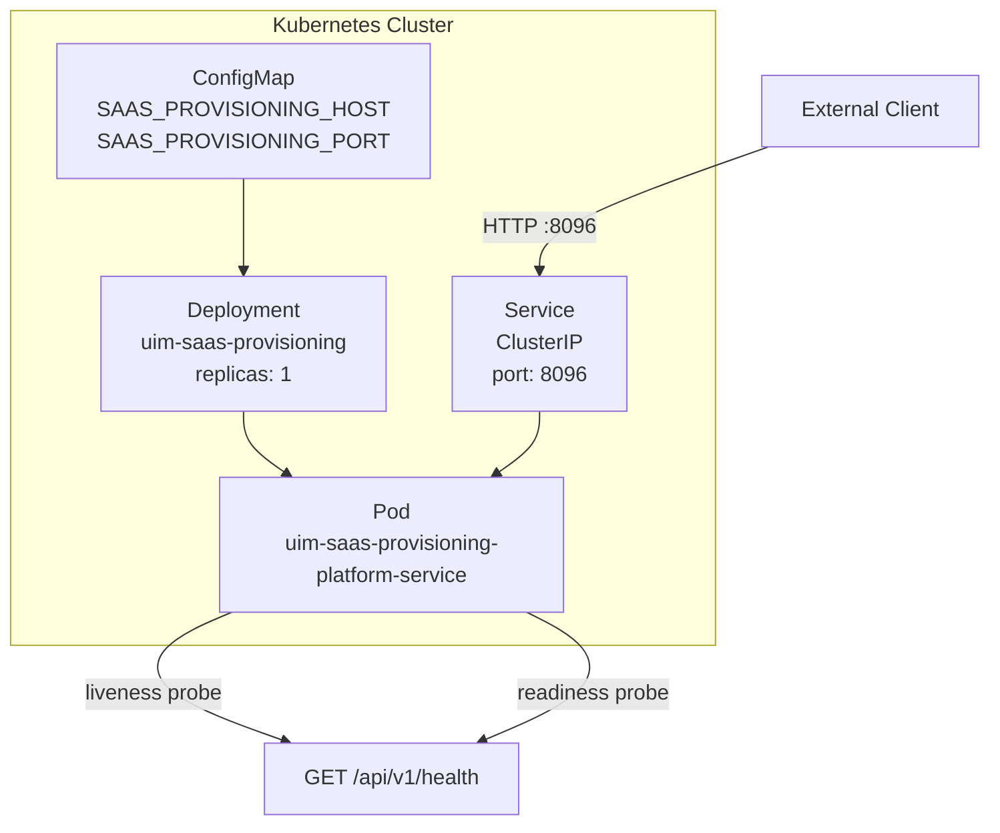

# NAFv4 Architecture Description — SAP SaaS Provisioning Service

> NATO Architecture Framework version 4 (NAFv4) applied to the SAP BTP SaaS Provisioning service implementation.

---

## 1. Overview (NAFv4 — C1: Capability Vision)

The **SaaS Provisioning Service** provides the capability to register multitenant SaaS applications on the SAP Business Technology Platform and manage the full subscription lifecycle for consumer tenants. It enables:

- **Application Registration** — Providers declare their application metadata, subscription/unsubscription callback URLs, and pricing plans
- **Subscription Lifecycle** — Consumers (tenants) subscribe to and unsubscribe from applications through a managed workflow
- **Asynchronous Job Tracking** — Long-running onboarding/offboarding jobs are tracked with status, progress, and error reporting
- **Multi-tenant Isolation** — Every operation is scoped to a provider tenant, ensuring data separation

---

## 2. Operational View (NOV — Operational)

### NOV-1: High-Level Operational Concept

```
┌─────────────────────────────────────────────────────────────────┐
│                        SAP BTP Platform                         │
│                                                                 │
│  ┌──────────────────────┐      ┌──────────────────────────┐     │
│  │  SaaS Provider       │      │  SaaS Consumer Tenant    │     │
│  │  (App Developer)     │      │  (Subscriber)            │     │
│  └─────────┬────────────┘      └──────────────┬───────────┘     │
│            │ Register App                      │ Subscribe       │
│            ▼                                   ▼                 │
│  ┌─────────────────────────────────────────────────────────┐    │
│  │            SaaS Provisioning Service                    │    │
│  │                                                         │    │
│  │   Applications ──► Subscriptions ──► Jobs               │    │
│  └─────────────────────────────────────────────────────────┘    │
└─────────────────────────────────────────────────────────────────┘
```

### NOV-2: Operational Node Connectivity

| Node | Role | Interfaces |
|------|------|------------|
| SaaS Provider | Registers and manages SaaS applications | REST API (POST /applications) |
| SaaS Consumer | Subscribes consumer tenants to applications | REST API (POST /subscriptions) |
| SaaS Provisioning Service | Manages application registry and subscription workflow | REST API on port 8096 |
| Kubernetes Cluster | Hosts and orchestrates the service | ConfigMap, Deployment, Service |

### NOV-3: Operational Activity Model

1. **Register Application** — Provider POSTs application metadata with callback URLs
2. **Update Application** — Provider updates registration details or subscription URLs
3. **Subscribe Tenant** — Consumer POSTs a subscription request; service creates job and triggers callback
4. **Track Job** — Consumer polls job endpoint for subscribe/unsubscribe progress
5. **Unsubscribe Tenant** — Consumer DELETEs subscription; service triggers offboarding callback
6. **Deregister Application** — Provider DELETEs application registration

---

## 3. System View (NSV — System)

### NSV-1: System Interface Description

```
┌─────────────────────────────────────────────────────────────────────┐
│                    SaaS Provisioning Service                        │
│                                                                     │
│  ┌────────────────────┐  HTTP REST   ┌──────────────────────────┐  │
│  │  Presentation Layer│◄────────────►│  External Clients        │  │
│  │  HTTP Controllers  │              │  (Provider / Consumer)   │  │
│  └────────┬───────────┘              └──────────────────────────┘  │
│           │                                                         │
│  ┌────────▼───────────┐                                             │
│  │  Application Layer │                                             │
│  │  Use Cases / DTOs  │                                             │
│  └────────┬───────────┘                                             │
│           │                                                         │
│  ┌────────▼───────────┐                                             │
│  │  Domain Layer      │                                             │
│  │  Entities/Ports/   │                                             │
│  │  Services          │                                             │
│  └────────┬───────────┘                                             │
│           │                                                         │
│  ┌────────▼───────────┐                                             │
│  │  Infrastructure    │                                             │
│  │  Repositories      │                                             │
│  │  (In-Memory)       │                                             │
│  └────────────────────┘                                             │
└─────────────────────────────────────────────────────────────────────┘
```

### NSV-2: System Resource Flow

| Resource | Flow | Description |
|----------|------|-------------|
| `SaasApplication` | Provider → Service → Repository | Application registration data |
| `AppSubscription` | Consumer → Service → Repository | Subscription lifecycle state |
| `SubscriptionJob` | Service internal → Repository | Async job tracking records |
| `CommandResult` | Repository → Service → Client | Operation result (success/id/error) |

### NSV-3: System Technology Forecast

| Component | Technology | Version |
|-----------|-----------|---------|
| HTTP Server | vibe.d | 0.10.x |
| Language | D (LDC) | 2.x |
| Package Manager | DUB | Latest |
| Container Runtime | Docker / Podman | Latest |
| Orchestration | Kubernetes | 1.28+ |
| Persistence | In-Memory (extensible to SQL/NoSQL) | — |

---

## 4. Technical View (NTV — Technical)

### NTV-1: Technical Standards Profile

| Standard | Application |
|----------|-------------|
| HTTP/1.1 (RFC 7231) | REST API transport |
| JSON (RFC 8259) | Request/response serialization |
| OpenAPI 3.0 (conceptual) | API documentation standard |
| OCI Image Spec | Container image format |
| Kubernetes API | Deployment target |
| Clean Architecture | Separation of concerns |
| Hexagonal Architecture | Ports and Adapters pattern |

### NTV-2: Technology Architecture

```
┌────────────────────────────────────────────────────────────────┐
│  Container Layer (OCI)                                         │
│  ┌────────────────────────────────────────────────────────┐   │
│  │  Runtime: LDC-compiled binary (multi-stage build)      │   │
│  │                                                         │   │
│  │  ┌─────────────────────────────────────────────────┐   │   │
│  │  │  vibe.d HTTP Server (event-loop, port 8096)     │   │   │
│  │  │                                                   │   │   │
│  │  │  URLRouter                                        │   │   │
│  │  │    /api/v1/saas-provisioning/applications (*)    │   │   │
│  │  │    /api/v1/saas-provisioning/subscriptions (*)   │   │   │
│  │  │    /api/v1/saas-provisioning/jobs (*)             │   │   │
│  │  │    /api/v1/health                                 │   │   │
│  │  └─────────────────────────────────────────────────┘   │   │
│  └────────────────────────────────────────────────────────┘   │
└────────────────────────────────────────────────────────────────┘
```

### NTV-3: Deployment Architecture



---

## 5. Service View (NSOV — Service-Oriented)

### NSOV-1: Service Taxonomy

| Service | Type | Consumers |
|---------|------|-----------|
| SaaS Application Registry | CRUD Resource Service | SaaS Providers |
| Subscription Management | Workflow Service | SaaS Consumers |
| Job Status | Read-Only Query Service | SaaS Providers and Consumers |
| Health Check | Platform Service | Kubernetes / Load Balancers |

### NSOV-2: Service Interface Specification

#### Application Registry Service

```
POST   /api/v1/saas-provisioning/applications
  Body: { appName, displayName, description, category, appUrls, plan, ... }
  Response 201: { id }

GET    /api/v1/saas-provisioning/applications
  Response 200: [ { id, appName, displayName, status, plan, ... } ]

GET    /api/v1/saas-provisioning/applications/:id
  Response 200: { id, appName, displayName, status, plan, appUrls, ... }
  Response 404: { error }

PUT    /api/v1/saas-provisioning/applications/:id
  Body: { displayName?, description?, appUrls?, plan?, ... }
  Response 200: { success }

DELETE /api/v1/saas-provisioning/applications/:id
  Response 200: { success }
```

#### Subscription Management Service

```
POST   /api/v1/saas-provisioning/subscriptions
  Body: { appName, subscriberTenantId, subscriberSubaccountId,
          subscriberGlobalAccountId, subdomain, subscribedBy }
  Response 201: { id, jobId }

GET    /api/v1/saas-provisioning/subscriptions?appName=...
  Response 200: [ { id, appName, subscriberTenantId, state, ... } ]

GET    /api/v1/saas-provisioning/subscriptions/:id
  Response 200: { id, appName, subscriberTenantId, state, consumerUrl, ... }

PUT    /api/v1/saas-provisioning/subscriptions/:id
  Body: { state?, consumerUrl?, error? }
  Response 200: { success }

DELETE /api/v1/saas-provisioning/subscriptions/:id
  Response 200: { jobId }
```

#### Job Status Service

```
GET    /api/v1/saas-provisioning/jobs
  Response 200: [ { id, jobType, jobStatus, progress, appName, ... } ]

GET    /api/v1/saas-provisioning/jobs/:id
  Response 200: { id, jobType, jobStatus, progress, message, error, ... }
  Response 404: { error }
```

---

## 6. Logical Data Model (NDDM — Data)

```
SaasApplication
  id (SaasApplicationId)
  tenantId
  appName (unique per tenant)
  displayName
  description
  category
  appUrls
    onSubscribeUrl
    onUnsubscribeUrl
    onUpdateDependenciesUrl
    getDependenciesUrl
    callbackUrl
  providerSubaccountId
  globalAccountId
  xsuaaServiceInstanceId
  plan (AppPlan)
  status (AppRegistrationStatus)
  dependencies[]
  autoSubscribeGlobalAccounts

AppSubscription
  id (AppSubscriptionId)
  tenantId (= provider tenant)
  appName → SaasApplication.appName
  appDisplayName
  subscriberTenantId
  subscriberSubaccountId
  subscriberGlobalAccountId
  subdomain
  consumerUrl
  state (SubscriptionState)
  subscribedBy
  jobId → SubscriptionJob.id
  error

SubscriptionJob
  id (SubscriptionJobId)
  tenantId
  appName → SaasApplication.appName
  subscriptionId → AppSubscription.id
  jobType (JobType)
  jobStatus (JobStatus)
  progress (0-100)
  message
  startedAt (ticks)
  finishedAt (ticks)
  error
```

---

## 7. Security Considerations (NAFv4 — C4: Standards)

| Concern | Approach |
|---------|----------|
| Authentication | Delegated to API Gateway / XSUAA (not implemented in service boundary) |
| Authorization | Tenant isolation enforced at repository level via `tenantId` scoping |
| Input Validation | JSON body parsing via vibe.d `req.json`; unknown fields ignored |
| Transport Security | TLS termination at Kubernetes Ingress / Load Balancer |
| Container Security | Non-root user (`appuser:1001`) in container image |
| Secret Management | Environment variables via Kubernetes ConfigMap (secrets via Kubernetes Secret in production) |

---

## 8. Configuration and Deployment Standards

| Item | Value |
|------|-------|
| Default Port | 8096 |
| Protocol | HTTP/1.1 REST |
| Image Base | `ldc2` (multi-stage build) |
| Health Probe Path | `/api/v1/health` |
| Kubernetes Service Type | `ClusterIP` |
| Resource Requests | CPU: 100m, Memory: 128Mi |
| Resource Limits | CPU: 500m, Memory: 512Mi |

---

*This document follows the NATO Architecture Framework version 4 (NAFv4) viewpoint taxonomy adapted for cloud-native microservice architecture.*
