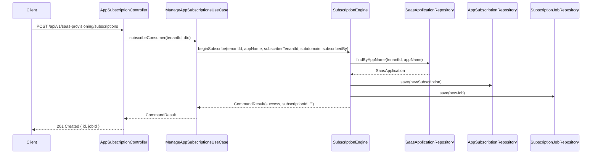
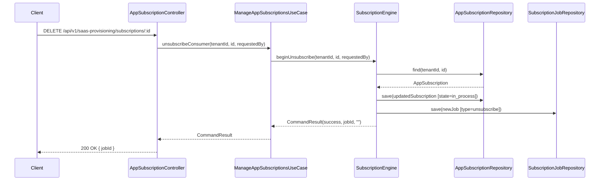
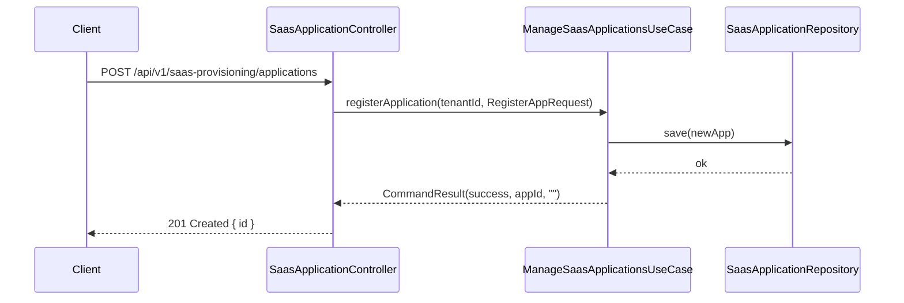
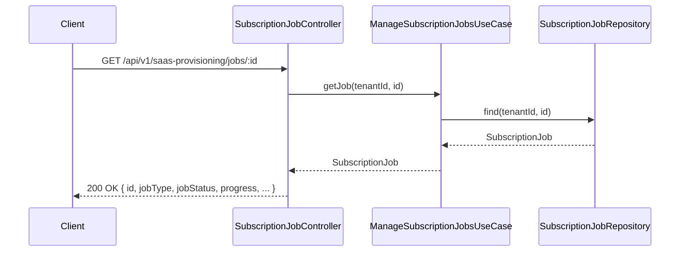

# UML Diagrams — SAP SaaS Provisioning Service

## Class Diagram

```mermaid
classDiagram
    direction TB

    %% ── Domain IDs ──────────────────────────────────────────────────
    class SaasApplicationId {
        +string value
    }
    class AppSubscriptionId {
        +string value
    }
    class SubscriptionJobId {
        +string value
    }

    %% ── Domain Enums ────────────────────────────────────────────────
    class AppRegistrationStatus {
        <<enumeration>>
        pending
        registered
        updating
        deregistering
        error
    }
    class SubscriptionState {
        <<enumeration>>
        in_process
        subscribed
        subscribe_failed
        unsubscribe_failed
        not_subscribed
    }
    class JobType {
        <<enumeration>>
        subscribe
        unsubscribe
        update
    }
    class JobStatus {
        <<enumeration>>
        in_progress
        succeeded
        failed
    }
    class AppPlan {
        <<enumeration>>
        standard
        professional
        enterprise
    }

    %% ── Domain Entities ─────────────────────────────────────────────
    class AppUrls {
        +string onSubscribeUrl
        +string onUnsubscribeUrl
        +string onUpdateDependenciesUrl
        +string getDependenciesUrl
        +string callbackUrl
        +Json toJson() const
    }
    class SaasApplication {
        +SaasApplicationId id
        +TenantId tenantId
        +string appName
        +string displayName
        +string description
        +string category
        +AppUrls appUrls
        +string providerSubaccountId
        +string globalAccountId
        +string xsuaaServiceInstanceId
        +AppPlan plan
        +AppRegistrationStatus status
        +string[] dependencies
        +bool autoSubscribeGlobalAccounts
        +Json toJson() const
        +bool isNull() const
    }
    class AppSubscription {
        +AppSubscriptionId id
        +TenantId tenantId
        +string appName
        +string appDisplayName
        +string subscriberTenantId
        +string subscriberSubaccountId
        +string subscriberGlobalAccountId
        +string subdomain
        +string consumerUrl
        +SubscriptionState state
        +string subscribedBy
        +string jobId
        +string error
        +Json toJson() const
        +bool isNull() const
    }
    class SubscriptionJob {
        +SubscriptionJobId id
        +TenantId tenantId
        +string appName
        +string subscriptionId
        +JobType jobType
        +JobStatus jobStatus
        +int progress
        +string message
        +long startedAt
        +long finishedAt
        +string error
        +Json toJson() const
        +bool isNull() const
    }

    SaasApplication *-- AppUrls
    SaasApplication --> AppRegistrationStatus
    SaasApplication --> AppPlan
    AppSubscription --> SubscriptionState
    SubscriptionJob --> JobType
    SubscriptionJob --> JobStatus

    %% ── Domain Ports (Repository Interfaces) ────────────────────────
    class SaasApplicationRepository {
        <<interface>>
        +findByAppName(tenantId, appName) SaasApplication
    }
    class AppSubscriptionRepository {
        <<interface>>
        +findByAppName(tenantId, appName) AppSubscription[]
        +findBySubscriberTenant(providerTenantId, subscriberTenantId) AppSubscription[]
    }
    class SubscriptionJobRepository {
        <<interface>>
        +findBySubscription(tenantId, subscriptionId) SubscriptionJob[]
    }

    %% ── Domain Services ─────────────────────────────────────────────
    class SubscriptionEngine {
        -SaasApplicationRepository appRepo
        -AppSubscriptionRepository subRepo
        -SubscriptionJobRepository jobRepo
        +beginSubscribe(providerTenantId, appName, subscriberTenantId, subdomain, subscribedBy) CommandResult
        +beginUnsubscribe(providerTenantId, subscriptionId, requestedBy) CommandResult
    }

    SubscriptionEngine --> SaasApplicationRepository
    SubscriptionEngine --> AppSubscriptionRepository
    SubscriptionEngine --> SubscriptionJobRepository

    %% ── Application Use Cases ───────────────────────────────────────
    class ManageSaasApplicationsUseCase {
        -SaasApplicationRepository repo
        +listApplications(tenantId) SaasApplication[]
        +getApplication(tenantId, id) SaasApplication
        +getApplicationByName(tenantId, name) SaasApplication
        +registerApplication(tenantId, dto) CommandResult
        +updateApplication(tenantId, id, dto) CommandResult
        +deregisterApplication(tenantId, id) CommandResult
    }
    class ManageAppSubscriptionsUseCase {
        -AppSubscriptionRepository repo
        -SubscriptionEngine engine
        +listForApp(tenantId, appName) AppSubscription[]
        +listAll(tenantId) AppSubscription[]
        +getSubscription(tenantId, id) AppSubscription
        +subscribeConsumer(tenantId, dto) CommandResult
        +unsubscribeConsumer(tenantId, id, requestedBy) CommandResult
        +updateSubscription(tenantId, id, dto) CommandResult
    }
    class ManageSubscriptionJobsUseCase {
        -SubscriptionJobRepository repo
        +listJobs(tenantId) SubscriptionJob[]
        +getJob(tenantId, id) SubscriptionJob
        +listJobsForSubscription(tenantId, subscriptionId) SubscriptionJob[]
    }

    ManageSaasApplicationsUseCase --> SaasApplicationRepository
    ManageAppSubscriptionsUseCase --> AppSubscriptionRepository
    ManageAppSubscriptionsUseCase --> SubscriptionEngine
    ManageSubscriptionJobsUseCase --> SubscriptionJobRepository

    %% ── Infrastructure ──────────────────────────────────────────────
    class MemorySaasApplicationRepository {
        +findByAppName(tenantId, appName) SaasApplication
    }
    class MemoryAppSubscriptionRepository {
        +findByAppName(tenantId, appName) AppSubscription[]
        +findBySubscriberTenant(providerTenantId, subscriberTenantId) AppSubscription[]
    }
    class MemorySubscriptionJobRepository {
        +findBySubscription(tenantId, subscriptionId) SubscriptionJob[]
    }

    MemorySaasApplicationRepository ..|> SaasApplicationRepository
    MemoryAppSubscriptionRepository ..|> AppSubscriptionRepository
    MemorySubscriptionJobRepository ..|> SubscriptionJobRepository

    %% ── Presentation ────────────────────────────────────────────────
    class SaasApplicationController {
        -ManageSaasApplicationsUseCase uc
        +registerRoutes(router)
        +handleList(req, res)
        +handleCreate(req, res)
        +handleGet(req, res)
        +handleUpdate(req, res)
        +handleDelete(req, res)
    }
    class AppSubscriptionController {
        -ManageAppSubscriptionsUseCase uc
        +registerRoutes(router)
        +handleList(req, res)
        +handleSubscribe(req, res)
        +handleGet(req, res)
        +handleUpdate(req, res)
        +handleUnsubscribe(req, res)
    }
    class SubscriptionJobController {
        -ManageSubscriptionJobsUseCase uc
        +registerRoutes(router)
        +handleList(req, res)
        +handleGet(req, res)
    }
    class HealthController {
        +registerRoutes(router)
        +handleHealth(req, res)
    }

    SaasApplicationController --> ManageSaasApplicationsUseCase
    AppSubscriptionController --> ManageAppSubscriptionsUseCase
    SubscriptionJobController --> ManageSubscriptionJobsUseCase
```

---

## Sequence Diagrams

### Subscribe Tenant to SaaS Application

### Unsubscribe Tenant from SaaS Application

### Register SaaS Application

### Get Subscription Job Status

