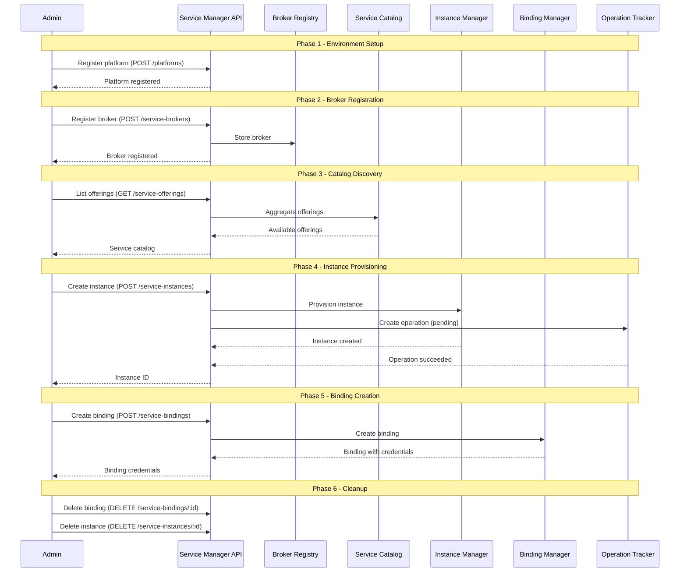
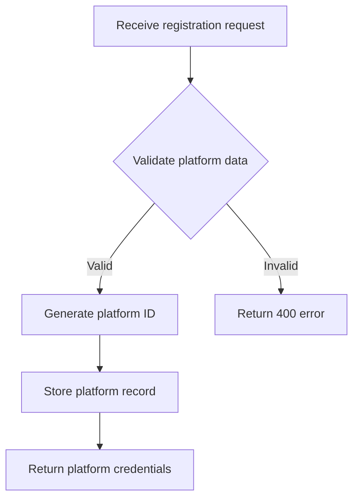
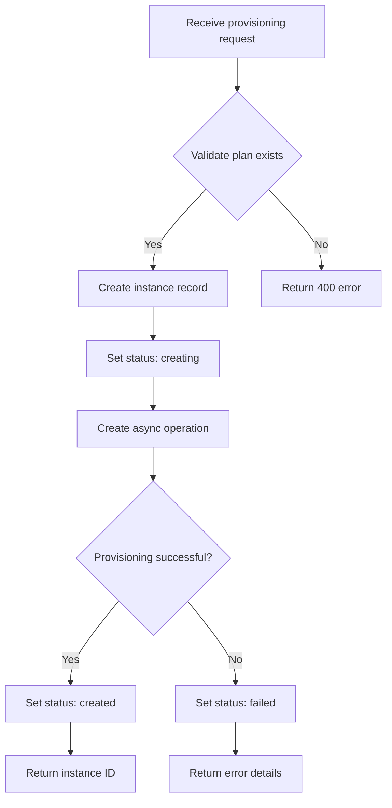
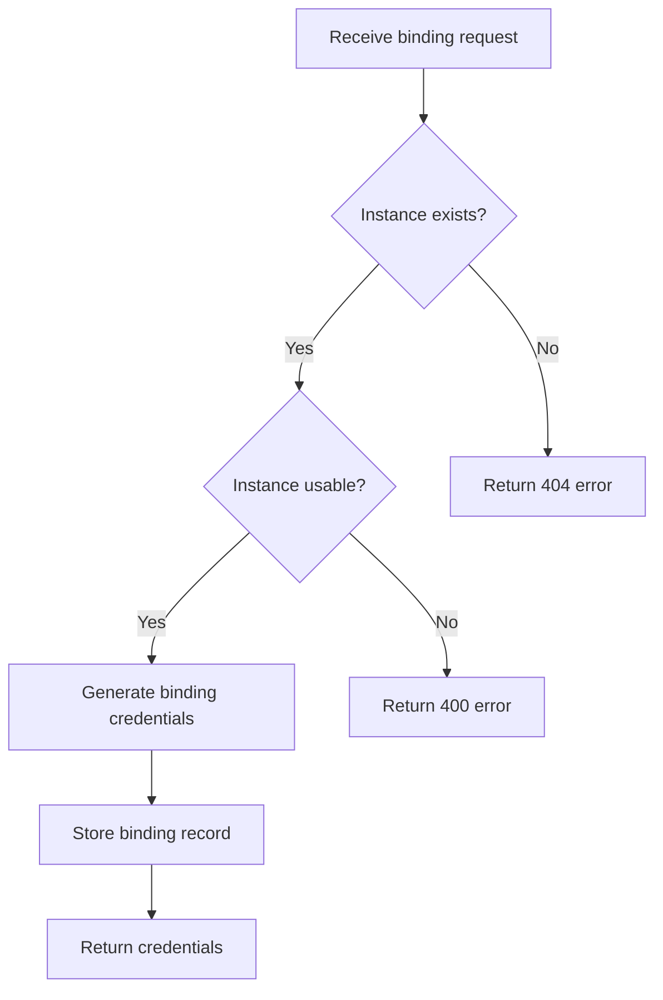
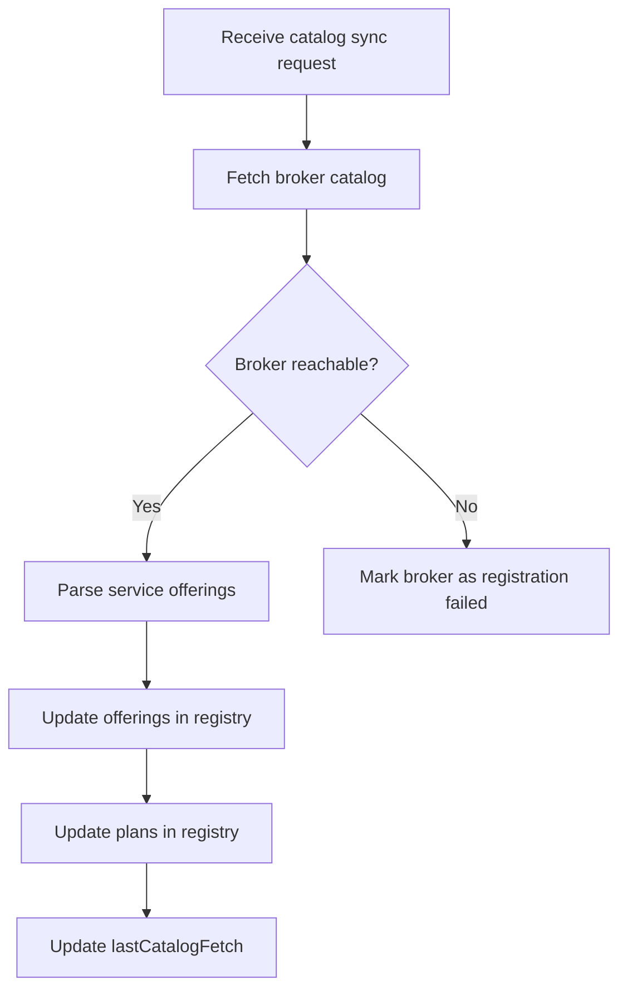

# Service Manager - NATO Architecture Framework v4 (NAFv4)

## C1 - Capability Taxonomy

Service Manager capabilities organized by domain:

| ID | Capability | Description |
|----|-----------|-------------|
| C1.1 | Platform Registration | Register and manage runtime environments (CF, K8s, Kyma) |
| C1.2 | Service Broker Management | Register OSB API-compatible service brokers |
| C1.3 | Service Catalog Browsing | Browse service offerings and plans from brokers |
| C1.4 | Service Instance Provisioning | Provision and manage service instances |
| C1.5 | Service Binding Management | Create and manage service binding credentials |
| C1.6 | Async Operation Tracking | Monitor long-running provisioning operations |
| C1.7 | Label Management | Attach and query key-value metadata on resources |
| C1.8 | Multi-tenant Isolation | Ensure strict tenant-level data separation |
| C1.9 | Service Sharing | Share service instances across environments |
| C1.10 | Health Monitoring | Expose service health status for orchestration |

## C2 - Enterprise Vision

The Service Manager service provides a centralized registry for managing service brokers, platforms, and service lifecycle in a multi-cloud BTP environment. It acts as the single source of truth for service instance state, enabling environments to discover, provision, bind, and consume platform services through a uniform API.

### Strategic Goals

1. Unified service consumption across heterogeneous runtime environments
2. Open Service Broker API compatibility for broker integration
3. Complete lifecycle management from provisioning to deprovisioning
4. Cross-environment service sharing with tenant isolation
5. Operational transparency through async operation tracking

## L1 - Node Types

| Node Type | Description | Examples |
|-----------|-------------|----------|
| API Gateway | Entry point for HTTP requests | vibe.d HTTP server |
| Platform Registry | Storage of registered platforms | In-memory / persistent store |
| Broker Registry | Storage of registered service brokers | In-memory / persistent store |
| Service Catalog | Aggregated service offerings and plans | CatalogAggregator domain service |
| Instance Manager | Service instance lifecycle management | ManageServiceInstancesUseCase |
| Binding Manager | Service binding lifecycle management | ManageServiceBindingsUseCase |
| Operation Tracker | Async operation status tracking | ManageOperationsUseCase |
| Label Store | Key-value metadata management | LabelRepository |

## L2 - Logical Scenario

### Service Provisioning Workflow

## L4 - Activity Workflow

### Workflow 1: Platform Onboarding

### Workflow 2: Service Instance Lifecycle

### Workflow 3: Service Binding Flow

### Workflow 4: Broker Catalog Sync

## P1 - Resource Types

| Resource Type | Technology | Purpose |
|--------------|------------|---------|
| Runtime | D (dlang) with LDC compiler | Service implementation |
| Web Framework | vibe.d (vibe-http) | HTTP server and routing |
| Container Runtime | Docker / Podman | Containerized deployment |
| Orchestration | Kubernetes | Production deployment and scaling |
| Configuration | Environment variables / ConfigMap | Runtime configuration |
| Build System | DUB | D package management and builds |

## S1 - Service Taxonomy

| Service ID | Service Name | Type | Port |
|-----------|-------------|------|------|
| SM-SVC-001 | Platform Registration Service | REST API | 8113 |
| SM-SVC-002 | Service Broker Registry | REST API | 8113 |
| SM-SVC-003 | Service Catalog Service | REST API | 8113 |
| SM-SVC-004 | Service Plan Service | REST API | 8113 |
| SM-SVC-005 | Instance Provisioning Service | REST API | 8113 |
| SM-SVC-006 | Binding Management Service | REST API | 8113 |
| SM-SVC-007 | Operation Tracking Service | REST API | 8113 |
| SM-SVC-008 | Label Management Service | REST API | 8113 |
| SM-SVC-009 | Health Check Service | REST API | 8113 |

## Sv-1 - Interface Description

### Service Manager API Interface Parameters

| Endpoint | Method | Parameters | Response |
|----------|--------|-----------|----------|
| `/api/v1/service-manager/platforms` | GET | Header: X-Tenant-ID | `{"items": [...], "totalCount": n}` |
| `/api/v1/service-manager/platforms` | POST | name, description, type, brokerUrl, credentials, region, subaccountId | `{"id": "..."}` |
| `/api/v1/service-manager/platforms/:id` | GET | Path: id | Platform JSON |
| `/api/v1/service-manager/platforms/:id` | PUT | name, description, type, brokerUrl, credentials, region | `{"id": "..."}` |
| `/api/v1/service-manager/platforms/:id` | DELETE | Path: id | Empty (204) |
| `/api/v1/service-manager/service-brokers` | GET | Header: X-Tenant-ID | `{"items": [...], "totalCount": n}` |
| `/api/v1/service-manager/service-brokers` | POST | name, description, brokerUrl | `{"id": "..."}` |
| `/api/v1/service-manager/service-brokers/:id` | GET | Path: id | ServiceBroker JSON |
| `/api/v1/service-manager/service-brokers/:id` | PUT | name, description, brokerUrl | `{"id": "..."}` |
| `/api/v1/service-manager/service-brokers/:id` | DELETE | Path: id | Empty (204) |
| `/api/v1/service-manager/service-offerings` | GET | Header: X-Tenant-ID | `{"items": [...], "totalCount": n}` |
| `/api/v1/service-manager/service-offerings` | POST | name, description, catalogName, brokerId, category, tags, metadata | `{"id": "..."}` |
| `/api/v1/service-manager/service-offerings/:id` | GET | Path: id | ServiceOffering JSON |
| `/api/v1/service-manager/service-offerings/:id` | PUT | name, description, catalogName, tags, metadata | `{"id": "..."}` |
| `/api/v1/service-manager/service-offerings/:id` | DELETE | Path: id | Empty (204) |
| `/api/v1/service-manager/service-plans` | GET | Header: X-Tenant-ID | `{"items": [...], "totalCount": n}` |
| `/api/v1/service-manager/service-plans` | POST | name, description, catalogName, offeringId, pricing, schemas, metadata | `{"id": "..."}` |
| `/api/v1/service-manager/service-plans/:id` | GET | Path: id | ServicePlan JSON |
| `/api/v1/service-manager/service-plans/:id` | PUT | name, description, schemas, metadata | `{"id": "..."}` |
| `/api/v1/service-manager/service-plans/:id` | DELETE | Path: id | Empty (204) |
| `/api/v1/service-manager/service-instances` | GET | Header: X-Tenant-ID | `{"items": [...], "totalCount": n}` |
| `/api/v1/service-manager/service-instances` | POST | name, planId, offeringId, platformId, context, parameters, labels | `{"id": "..."}` |
| `/api/v1/service-manager/service-instances/:id` | GET | Path: id | ServiceInstance JSON |
| `/api/v1/service-manager/service-instances/:id` | PUT | name, planId, parameters, labels | `{"id": "..."}` |
| `/api/v1/service-manager/service-instances/:id` | DELETE | Path: id | Empty (204) |
| `/api/v1/service-manager/service-bindings` | GET | Header: X-Tenant-ID | `{"items": [...], "totalCount": n}` |
| `/api/v1/service-manager/service-bindings` | POST | name, instanceId, parameters, bindResource, context, labels | `{"id": "..."}` |
| `/api/v1/service-manager/service-bindings/:id` | GET | Path: id | ServiceBinding JSON |
| `/api/v1/service-manager/service-bindings/:id` | PUT | name, parameters, labels | `{"id": "..."}` |
| `/api/v1/service-manager/service-bindings/:id` | DELETE | Path: id | Empty (204) |
| `/api/v1/service-manager/operations` | GET | Header: X-Tenant-ID | `{"items": [...], "totalCount": n}` |
| `/api/v1/service-manager/operations` | POST | resourceId, resourceType, type, description | `{"id": "..."}` |
| `/api/v1/service-manager/operations/:id` | GET | Path: id | Operation JSON |
| `/api/v1/service-manager/operations/:id` | PUT | status, errorMessage | `{"id": "..."}` |
| `/api/v1/service-manager/operations/:id` | DELETE | Path: id | Empty (204) |
| `/api/v1/service-manager/labels` | GET | Header: X-Tenant-ID | `{"items": [...], "totalCount": n}` |
| `/api/v1/service-manager/labels` | POST | resourceId, resourceType, key, value | `{"id": "..."}` |
| `/api/v1/service-manager/labels/:id` | GET | Path: id | Label JSON |
| `/api/v1/service-manager/labels/:id` | PUT | key, value | `{"id": "..."}` |
| `/api/v1/service-manager/labels/:id` | DELETE | Path: id | Empty (204) |
| `/health` | GET | None | `{"status": "UP"}` |
