# Service Manager - UML Diagrams

## Class Diagram

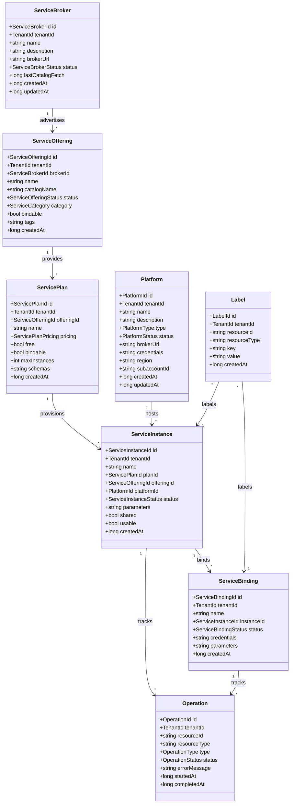

## Repository Interfaces

```mermaid
classDiagram
    class PlatformRepository {
        <<interface>>
        +findByTenant(TenantId) Platform[]
        +findById(TenantId, PlatformId) Platform*
        +save(Platform) void
        +update(Platform) void
        +removeById(tenantId, PlatformId) void
        +countByTenant(TenantId) ulong
    }

    class ServiceBrokerRepository {
        <<interface>>
        +findByTenant(TenantId) ServiceBroker[]
        +findById(TenantId, ServiceBrokerId) ServiceBroker*
        +save(ServiceBroker) void
        +update(ServiceBroker) void
        +removeById(tenantId, ServiceBrokerId) void
    }

    class ServiceOfferingRepository {
        <<interface>>
        +findByTenant(TenantId) ServiceOffering[]
        +findById(TenantId, ServiceOfferingId) ServiceOffering*
        +save(ServiceOffering) void
        +update(ServiceOffering) void
        +removeById(tenantId, ServiceOfferingId) void
    }

    class ServicePlanRepository {
        <<interface>>
        +findByTenant(TenantId) ServicePlan[]
        +findById(TenantId, ServicePlanId) ServicePlan*
        +save(ServicePlan) void
        +update(ServicePlan) void
        +removeById(tenantId, ServicePlanId) void
    }

    class ServiceInstanceRepository {
        <<interface>>
        +findByTenant(TenantId) ServiceInstance[]
        +findById(TenantId, ServiceInstanceId) ServiceInstance*
        +save(ServiceInstance) void
        +update(ServiceInstance) void
        +removeById(tenantId, ServiceInstanceId) void
    }

    class ServiceBindingRepository {
        <<interface>>
        +findByTenant(TenantId) ServiceBinding[]
        +findById(TenantId, ServiceBindingId) ServiceBinding*
        +save(ServiceBinding) void
        +update(ServiceBinding) void
        +removeById(tenantId, ServiceBindingId) void
    }

    class OperationRepository {
        <<interface>>
        +findByTenant(TenantId) Operation[]
        +findById(TenantId, OperationId) Operation*
        +save(Operation) void
        +update(Operation) void
        +removeById(tenantId, OperationId) void
    }

    class LabelRepository {
        <<interface>>
        +findByTenant(TenantId) Label[]
        +findById(TenantId, LabelId) Label*
        +findByResource(TenantId, string, string) Label[]
        +save(Label) void
        +update(Label) void
        +removeById(tenantId, LabelId) void
    }
```

## Domain Service

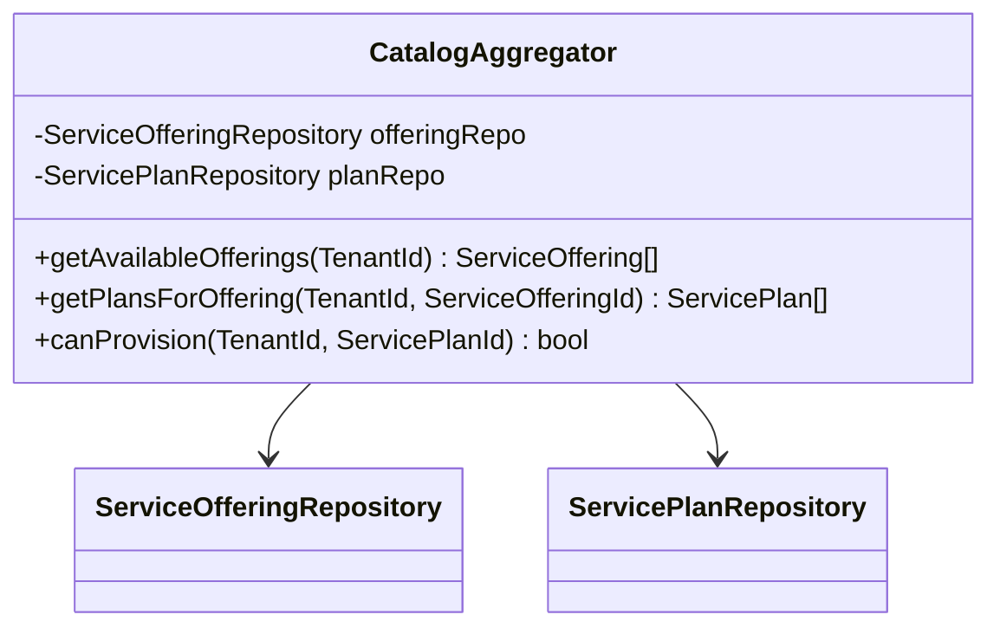

## Component Diagram

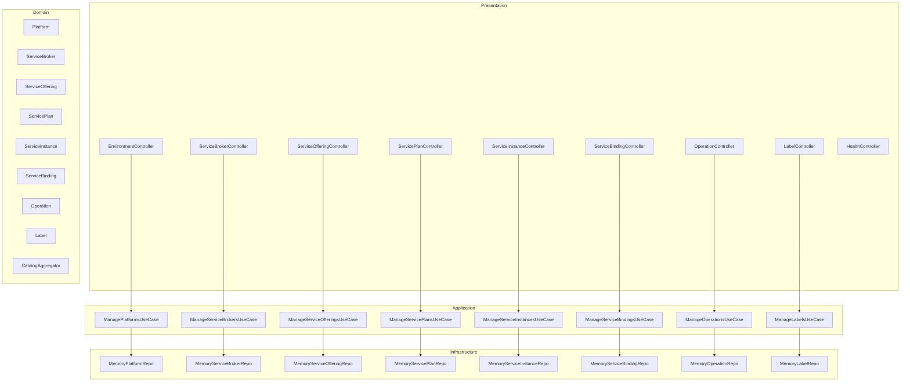

## Sequence Diagrams

### Service Instance Provisioning

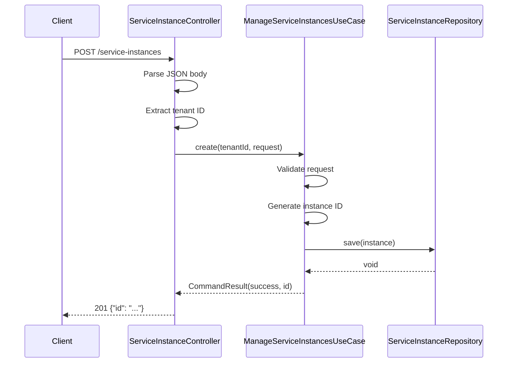

### Service Binding Creation

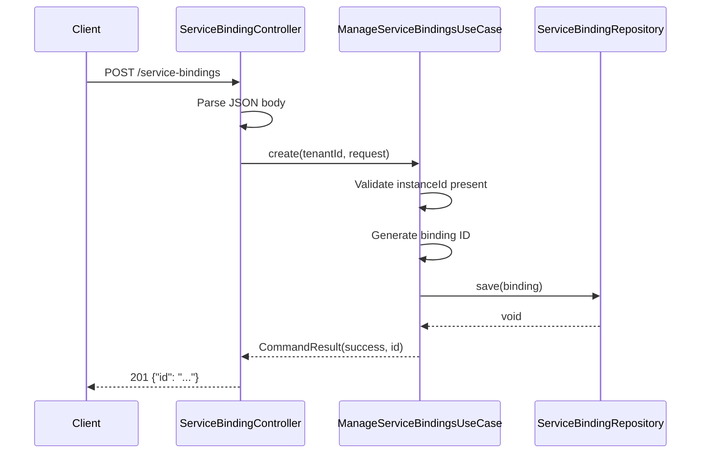

### Service Broker Registration

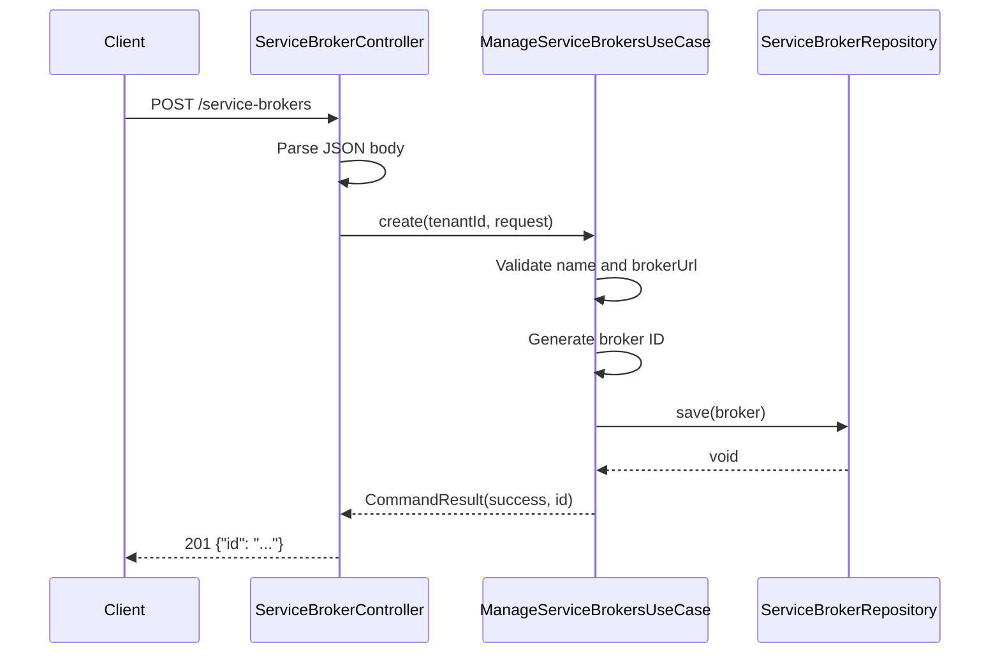

### Platform Registration

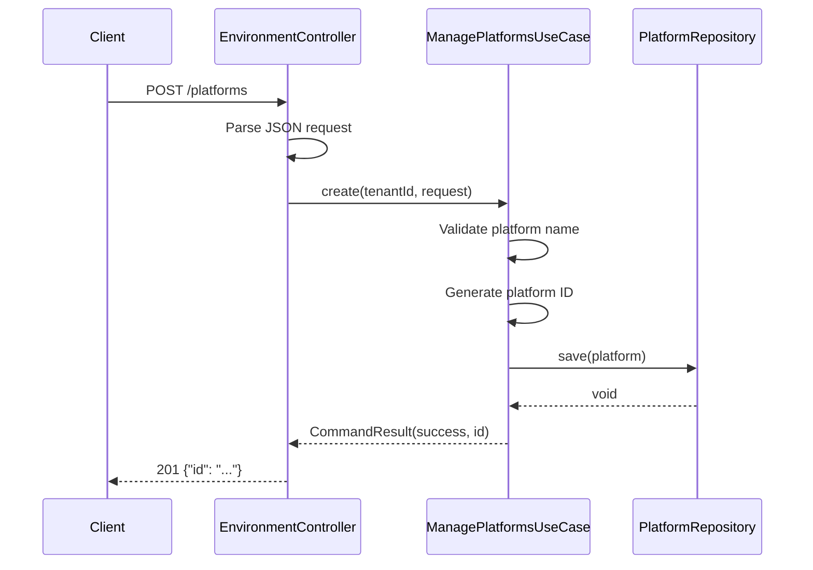

## State Diagrams

### Service Instance Lifecycle

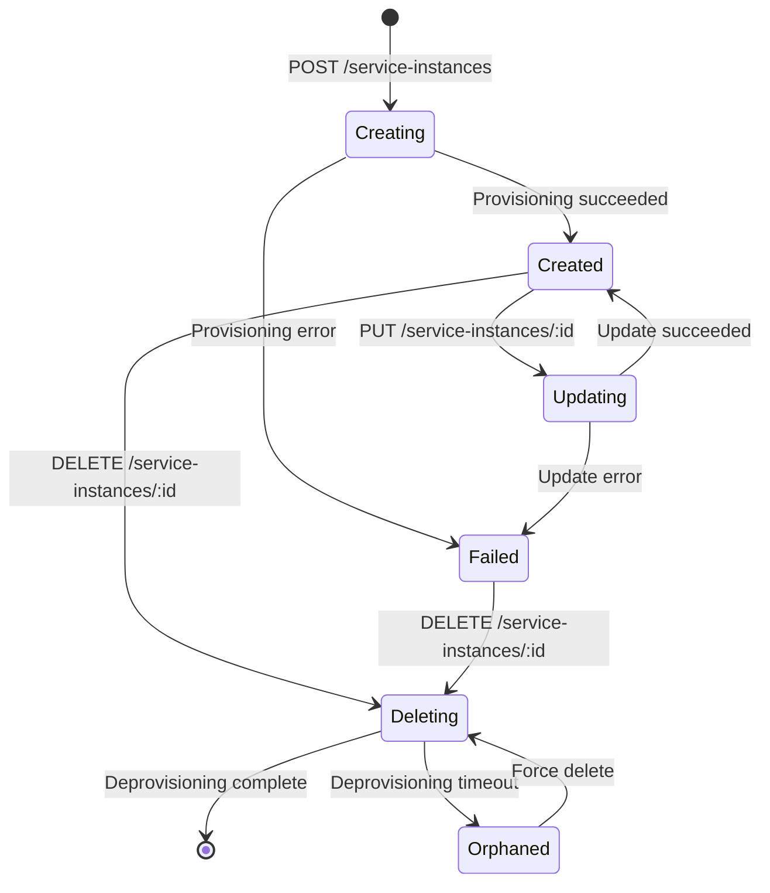

### Service Binding Lifecycle

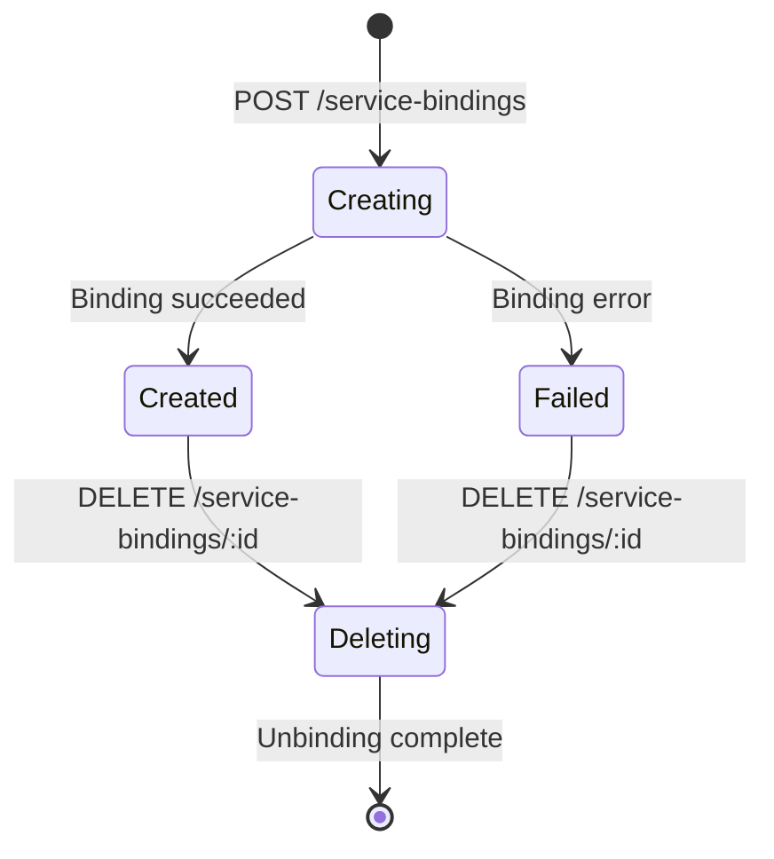

### Operation Lifecycle

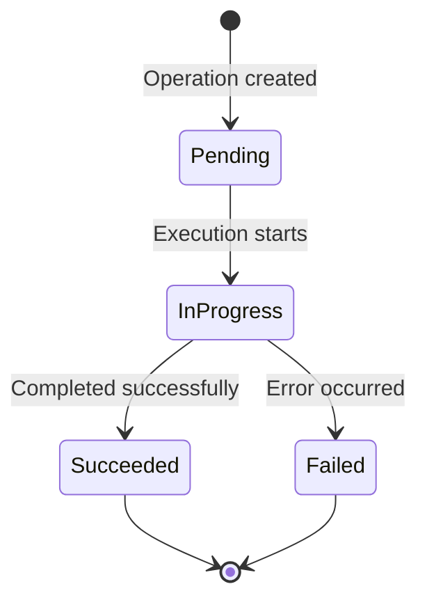
