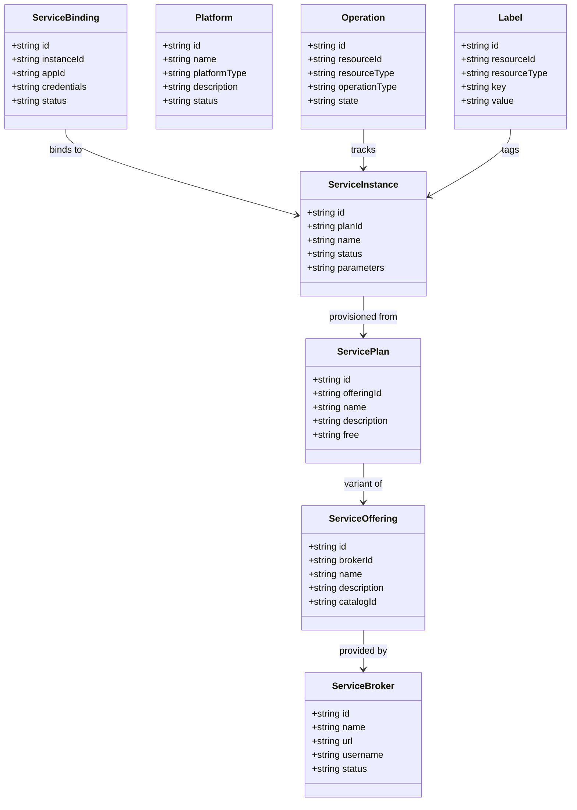
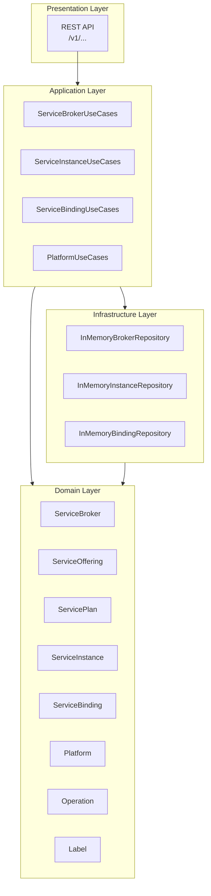
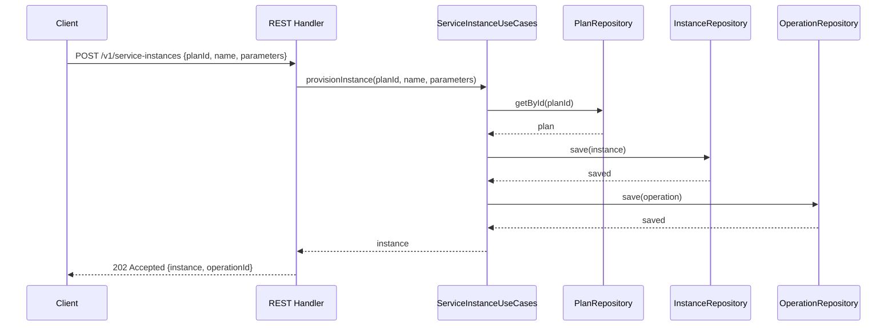

# UML Diagrams — Service Manager Service

## Class Diagram

```mermaid
classDiagram
    class ServiceBroker {
        +string id
        +string name
        +string url
        +string username
        +string status
    }
    class ServiceOffering {
        +string id
        +string brokerId
        +string name
        +string description
        +string catalogId
    }
    class ServicePlan {
        +string id
        +string offeringId
        +string name
        +string description
        +string free
    }
    class ServiceInstance {
        +string id
        +string planId
        +string name
        +string status
        +string parameters
    }
    class ServiceBinding {
        +string id
        +string instanceId
        +string appId
        +string credentials
        +string status
    }
    class Platform {
        +string id
        +string name
        +string platformType
        +string description
        +string status
    }
    class Operation {
        +string id
        +string resourceId
        +string resourceType
        +string operationType
        +string state
    }
    class Label {
        +string id
        +string resourceId
        +string resourceType
        +string key
        +string value
    }

    ServiceOffering --> ServiceBroker : provided by
    ServicePlan --> ServiceOffering : variant of
    ServiceInstance --> ServicePlan : provisioned from
    ServiceBinding --> ServiceInstance : binds to
    Operation --> ServiceInstance : tracks
    Label --> ServiceInstance : tags
```

## Component Diagram

```mermaid
flowchart TB
    subgraph Presentation["Presentation Layer"]
        REST["REST API\n/v1/..."]
    end
    subgraph Application["Application Layer"]
        BROKER_UC["ServiceBrokerUseCases"]
        INSTANCE_UC["ServiceInstanceUseCases"]
        BINDING_UC["ServiceBindingUseCases"]
        PLAT_UC["PlatformUseCases"]
    end
    subgraph Domain["Domain Layer"]
        BROKER["ServiceBroker"]
        OFFERING["ServiceOffering"]
        PLAN["ServicePlan"]
        INSTANCE["ServiceInstance"]
        BINDING["ServiceBinding"]
        PLAT["Platform"]
        OP["Operation"]
        LABEL["Label"]
    end
    subgraph Infrastructure["Infrastructure Layer"]
        BROKER_REPO["InMemoryBrokerRepository"]
        INSTANCE_REPO["InMemoryInstanceRepository"]
        BINDING_REPO["InMemoryBindingRepository"]
    end

    REST --> Application
    Application --> Domain
    Infrastructure --> Domain
    Application --> Infrastructure
```

## Sequence Diagram — Provision Service Instance

```mermaid
sequenceDiagram
    participant C as Client
    participant R as REST Handler
    participant UC as ServiceInstanceUseCases
    participant PR as PlanRepository
    participant IR as InstanceRepository
    participant OR as OperationRepository

    C->>R: POST /v1/service-instances {planId, name, parameters}
    R->>UC: provisionInstance(planId, name, parameters)
    UC->>PR: getById(planId)
    PR-->>UC: plan
    UC->>IR: save(instance)
    IR-->>UC: saved
    UC->>OR: save(operation)
    OR-->>UC: saved
    UC-->>R: instance
    R-->>C: 202 Accepted {instance, operationId}
```
