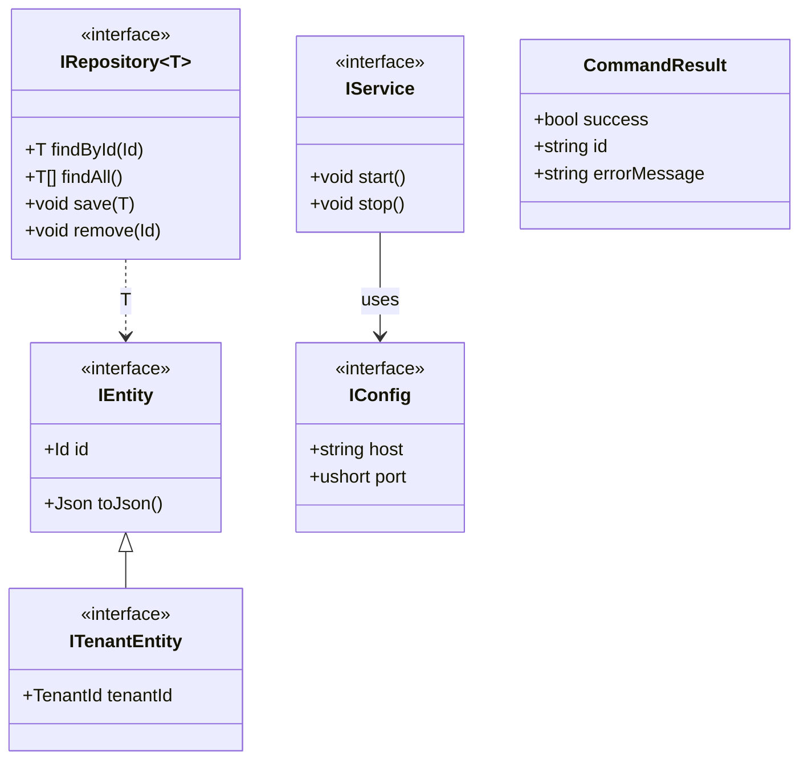
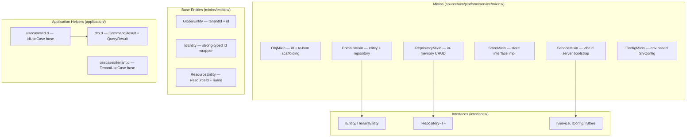
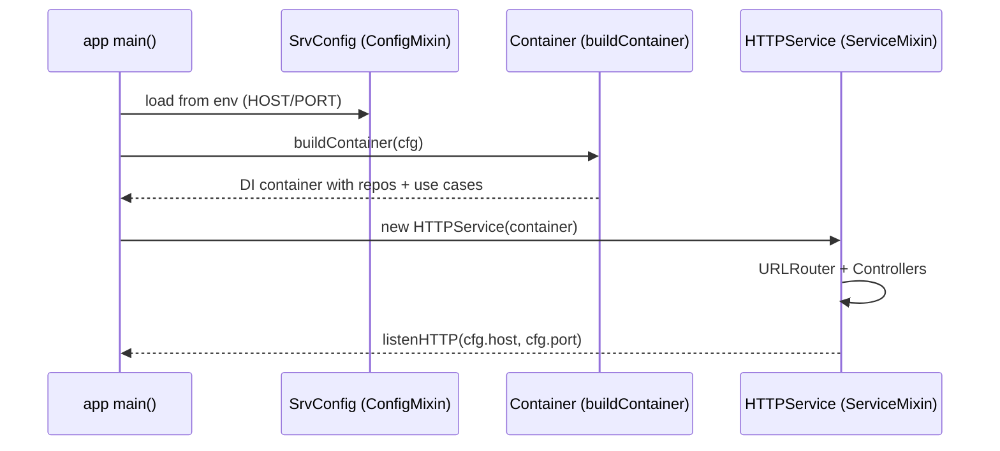

# UML — Service Library (uim-platform-service)

> The `service` package is a **shared D library** — not an HTTP service.
> It provides the hexagonal-architecture scaffolding mixins, interfaces,
> base entities, and use-case helpers that every UIM Platform service depends on.

## Module Structure

---

## Mixin / Template Hierarchy

---

## Usage Pattern — Service Bootstrap

