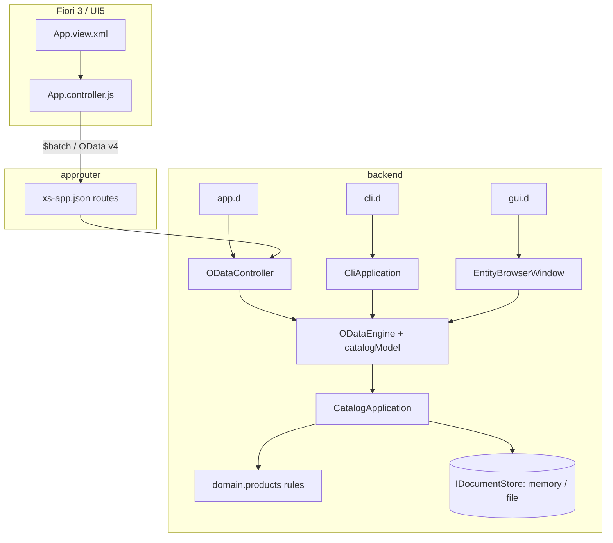
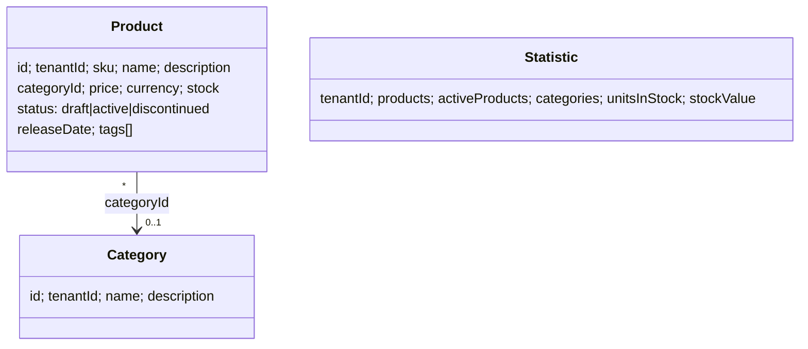

# UML — Catalog Reference Service

```mermaid
flowchart TB
    subgraph frontend [Fiori 3 / UI5]
      V[App.view.xml] --> Ctl[App.controller.js]
    end
    subgraph approuter
      XS[xs-app.json routes]
    end
    subgraph backend
      APP[app.d] --> ODC[ODataController]
      CLI[cli.d] --> CA[CliApplication]
      GUI[gui.d] --> EB[EntityBrowserWindow]
      ODC --> ENG[ODataEngine + catalogModel]
      CA --> ENG
      EB --> ENG
      ENG --> CATA[CatalogApplication]
      CATA --> DOM[domain.products rules]
      CATA --> STORE[(IDocumentStore: memory / file)]
    end
    Ctl -- "$batch / OData v4" --> XS --> ODC
```

```mermaid
classDiagram
    class Product {
      id; tenantId; sku; name; description
      categoryId; price; currency; stock
      status: draft|active|discontinued
      releaseDate; tags[]
    }
    class Category { id; tenantId; name; description }
    class Statistic { tenantId; products; activeProducts; categories; unitsInStock; stockValue }
    Product "*" --> "0..1" Category : categoryId
```
