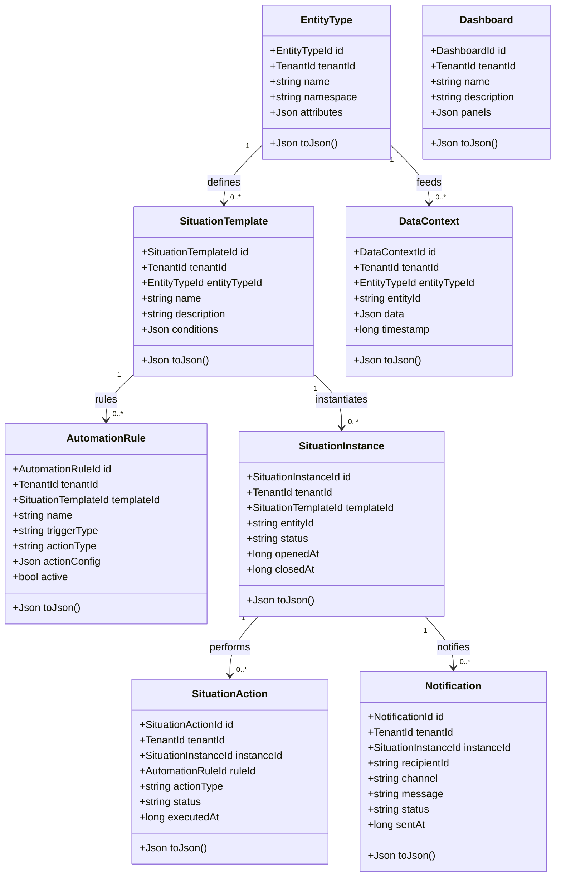
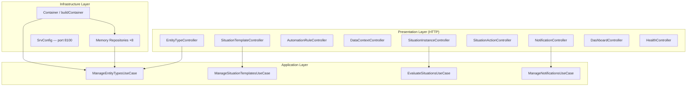
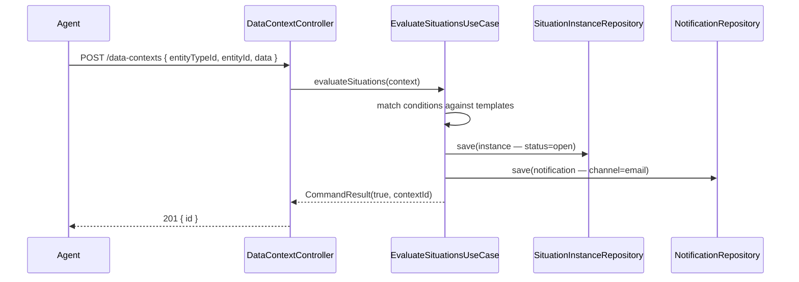

# UML — Situation Automation Service

## Class Diagram — Domain Entities

```mermaid
classDiagram
    class EntityType {
        +EntityTypeId id
        +TenantId tenantId
        +string name
        +string namespace
        +Json attributes
        +Json toJson()
    }
    class SituationTemplate {
        +SituationTemplateId id
        +TenantId tenantId
        +EntityTypeId entityTypeId
        +string name
        +string description
        +Json conditions
        +Json toJson()
    }
    class AutomationRule {
        +AutomationRuleId id
        +TenantId tenantId
        +SituationTemplateId templateId
        +string name
        +string triggerType
        +string actionType
        +Json actionConfig
        +bool active
        +Json toJson()
    }
    class DataContext {
        +DataContextId id
        +TenantId tenantId
        +EntityTypeId entityTypeId
        +string entityId
        +Json data
        +long timestamp
        +Json toJson()
    }
    class SituationInstance {
        +SituationInstanceId id
        +TenantId tenantId
        +SituationTemplateId templateId
        +string entityId
        +string status
        +long openedAt
        +long closedAt
        +Json toJson()
    }
    class SituationAction {
        +SituationActionId id
        +TenantId tenantId
        +SituationInstanceId instanceId
        +AutomationRuleId ruleId
        +string actionType
        +string status
        +long executedAt
        +Json toJson()
    }
    class Notification {
        +NotificationId id
        +TenantId tenantId
        +SituationInstanceId instanceId
        +string recipientId
        +string channel
        +string message
        +string status
        +long sentAt
        +Json toJson()
    }
    class Dashboard {
        +DashboardId id
        +TenantId tenantId
        +string name
        +string description
        +Json panels
        +Json toJson()
    }

    EntityType "1" --> "0..*" SituationTemplate : defines
    EntityType "1" --> "0..*" DataContext : feeds
    SituationTemplate "1" --> "0..*" SituationInstance : instantiates
    SituationTemplate "1" --> "0..*" AutomationRule : rules
    SituationInstance "1" --> "0..*" SituationAction : performs
    SituationInstance "1" --> "0..*" Notification : notifies
```

---

## Component Diagram

```mermaid
flowchart TB
    subgraph Presentation["Presentation Layer (HTTP)"]
        C1[EntityTypeController]
        C2[SituationTemplateController]
        C3[AutomationRuleController]
        C4[DataContextController]
        C5[SituationInstanceController]
        C6[SituationActionController]
        C7[NotificationController]
        C8[DashboardController]
        HC[HealthController]
    end
    subgraph Application["Application Layer"]
        UC1[ManageEntityTypesUseCase]
        UC2[ManageSituationTemplatesUseCase]
        UC3[EvaluateSituationsUseCase]
        UC4[ManageNotificationsUseCase]
    end
    subgraph Infrastructure["Infrastructure Layer"]
        MEM[Memory Repositories ×8]
        CFG[SrvConfig — port 8100]
        CTR[Container / buildContainer]
    end
    C1 --> UC1
    C2 --> UC2
    C5 --> UC3
    C7 --> UC4
    MEM --> UC1
    CTR --> UC1
    CTR --> MEM
```

---

## Sequence Diagram — Evaluate Data Context and Open Situation

```mermaid
sequenceDiagram
    participant Agent
    participant DCC as DataContextController
    participant EAUC as EvaluateSituationsUseCase
    participant SIR as SituationInstanceRepository
    participant NR as NotificationRepository

    Agent->>DCC: POST /data-contexts { entityTypeId, entityId, data }
    DCC->>EAUC: evaluateSituations(context)
    EAUC->>EAUC: match conditions against templates
    EAUC->>SIR: save(instance — status=open)
    EAUC->>NR: save(notification — channel=email)
    EAUC-->>DCC: CommandResult(true, contextId)
    DCC-->>Agent: 201 { id }
```
