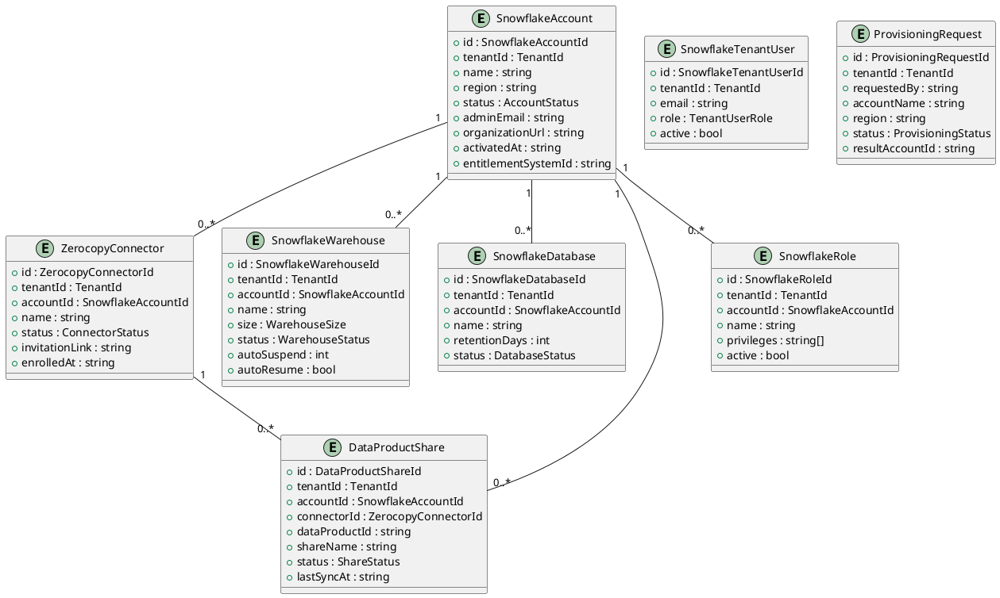
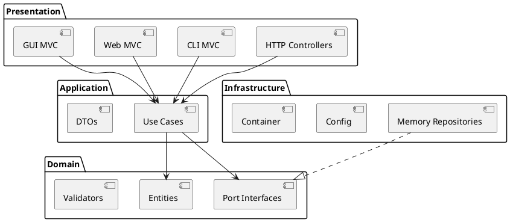
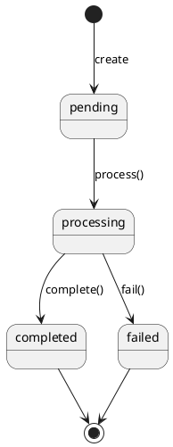
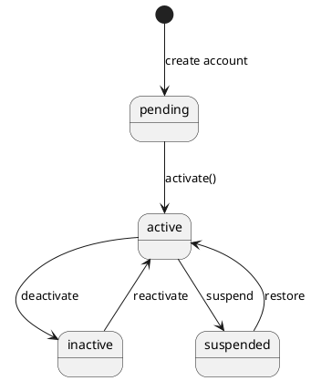
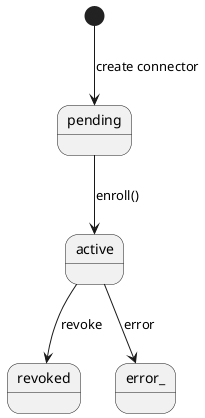

# UML — SAP Snowflake Service

## Domain Entity Diagram

```plantuml
@startuml
entity SnowflakeAccount {
  + id : SnowflakeAccountId
  + tenantId : TenantId
  + name : string
  + region : string
  + status : AccountStatus
  + adminEmail : string
  + organizationUrl : string
  + activatedAt : string
  + entitlementSystemId : string
}

entity ZerocopyConnector {
  + id : ZerocopyConnectorId
  + tenantId : TenantId
  + accountId : SnowflakeAccountId
  + name : string
  + status : ConnectorStatus
  + invitationLink : string
  + enrolledAt : string
}

entity SnowflakeWarehouse {
  + id : SnowflakeWarehouseId
  + tenantId : TenantId
  + accountId : SnowflakeAccountId
  + name : string
  + size : WarehouseSize
  + status : WarehouseStatus
  + autoSuspend : int
  + autoResume : bool
}

entity SnowflakeDatabase {
  + id : SnowflakeDatabaseId
  + tenantId : TenantId
  + accountId : SnowflakeAccountId
  + name : string
  + retentionDays : int
  + status : DatabaseStatus
}

entity DataProductShare {
  + id : DataProductShareId
  + tenantId : TenantId
  + accountId : SnowflakeAccountId
  + connectorId : ZerocopyConnectorId
  + dataProductId : string
  + shareName : string
  + status : ShareStatus
  + lastSyncAt : string
}

entity SnowflakeRole {
  + id : SnowflakeRoleId
  + tenantId : TenantId
  + accountId : SnowflakeAccountId
  + name : string
  + privileges : string[]
  + active : bool
}

entity SnowflakeTenantUser {
  + id : SnowflakeTenantUserId
  + tenantId : TenantId
  + email : string
  + role : TenantUserRole
  + active : bool
}

entity ProvisioningRequest {
  + id : ProvisioningRequestId
  + tenantId : TenantId
  + requestedBy : string
  + accountName : string
  + region : string
  + status : ProvisioningStatus
  + resultAccountId : string
}

SnowflakeAccount "1" -- "0..*" ZerocopyConnector
SnowflakeAccount "1" -- "0..*" SnowflakeWarehouse
SnowflakeAccount "1" -- "0..*" SnowflakeDatabase
SnowflakeAccount "1" -- "0..*" DataProductShare
SnowflakeAccount "1" -- "0..*" SnowflakeRole
ZerocopyConnector "1" -- "0..*" DataProductShare
@enduml
```

## Hexagonal Architecture

```plantuml
@startuml
package "Domain" {
  [Entities]
  [Port Interfaces]
  [Validators]
}

package "Application" {
  [Use Cases]
  [DTOs]
}

package "Infrastructure" {
  [Memory Repositories]
  [Config]
  [Container]
}

package "Presentation" {
  [HTTP Controllers]
  [CLI MVC]
  [Web MVC]
  [GUI MVC]
}

[Use Cases] --> [Port Interfaces]
[Use Cases] --> [Entities]
[Memory Repositories] ..|> [Port Interfaces]
[HTTP Controllers] --> [Use Cases]
[CLI MVC] --> [Use Cases]
[Web MVC] --> [Use Cases]
[GUI MVC] --> [Use Cases]
@enduml
```

## Provisioning Request State Machine

```plantuml
@startuml
[*] --> pending : create
pending --> processing : process()
processing --> completed : complete()
processing --> failed : fail()
completed --> [*]
failed --> [*]
@enduml
```

## Account Lifecycle

```plantuml
@startuml
[*] --> pending : create account
pending --> active : activate()
active --> inactive : deactivate
inactive --> active : reactivate
active --> suspended : suspend
suspended --> active : restore
@enduml
```

## Connector Enrollment

```plantuml
@startuml
[*] --> pending : create connector
pending --> active : enroll()
active --> revoked : revoke
active --> error_ : error
@enduml
```
