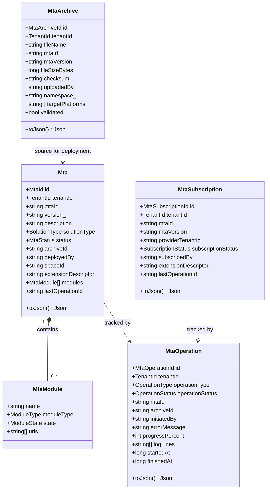
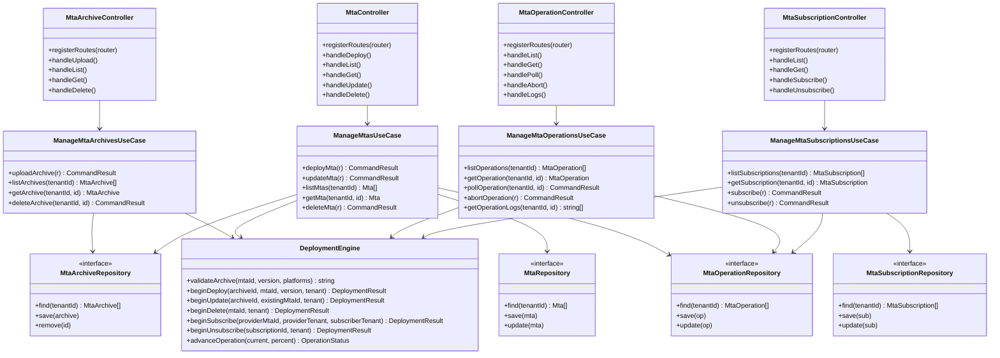
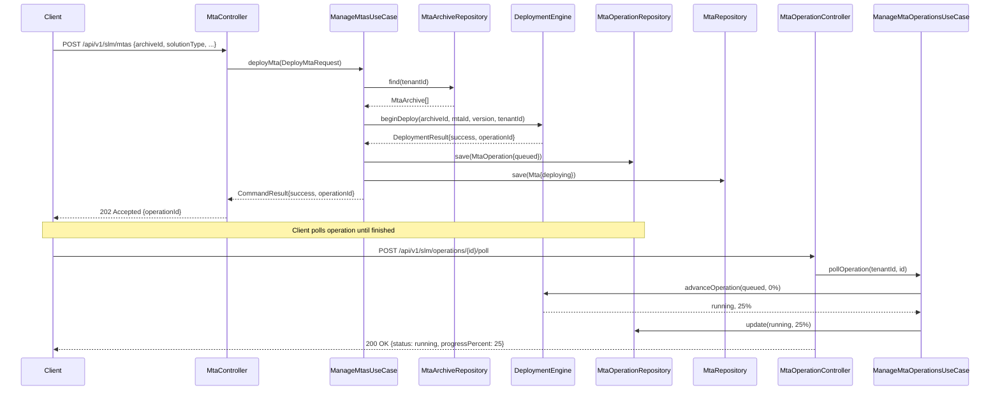
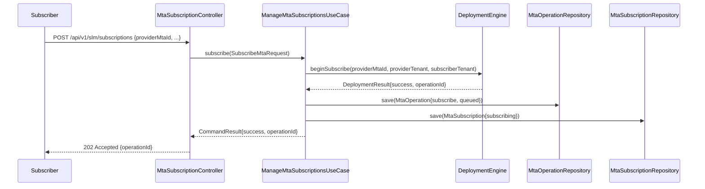
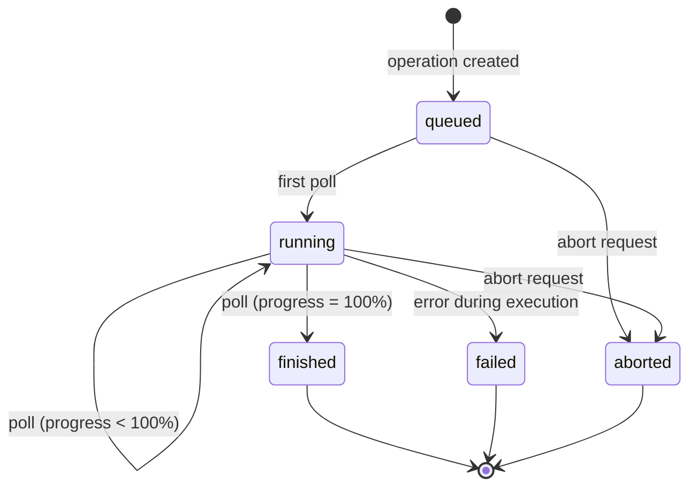
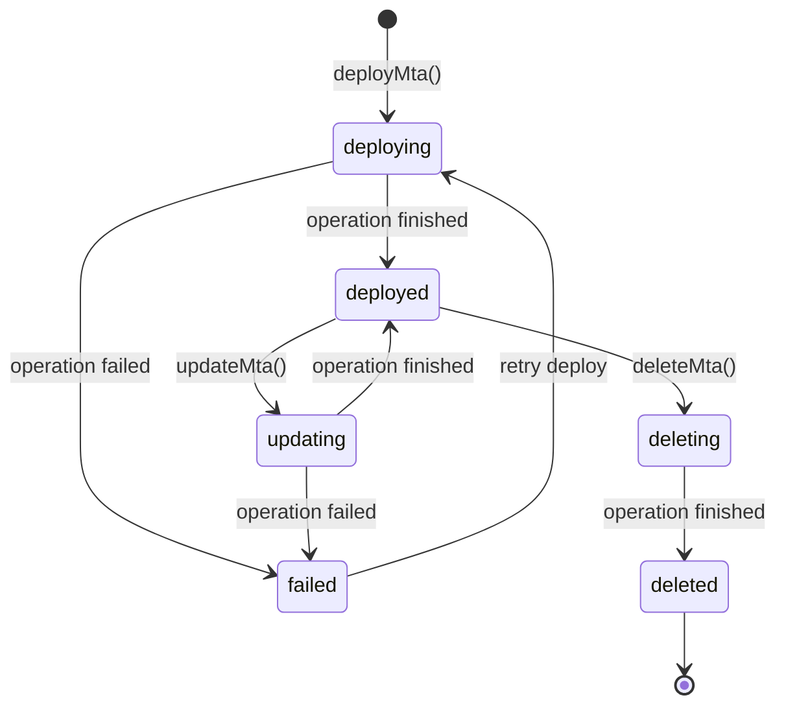
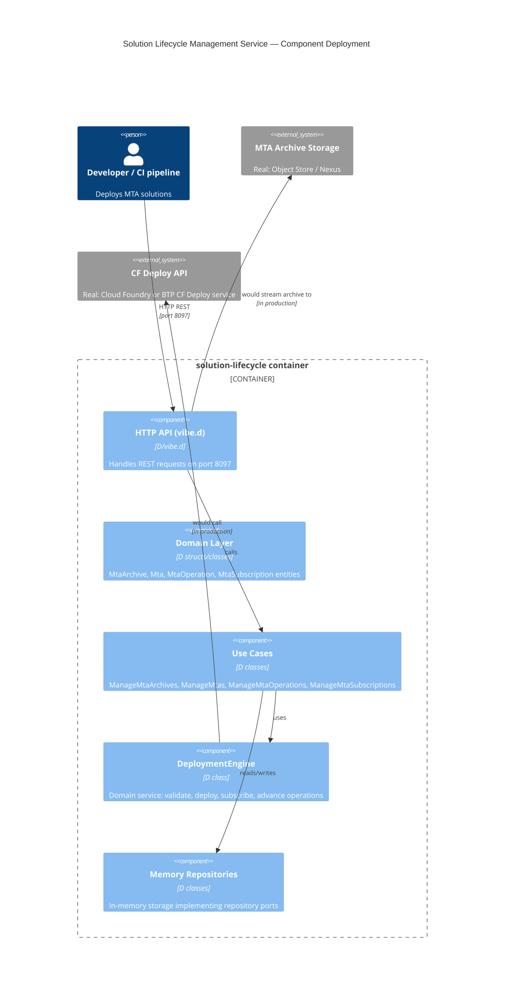

# UML — Solution Lifecycle Management Service

## 1. Domain Class Diagram

## 2. Hexagonal Architecture

## 3. Sequence Diagram — Deploy MTA

## 4. Sequence Diagram — Subscribe to Provided Solution

## 5. State Diagram — MTA Operation Lifecycle

## 6. State Diagram — MTA Solution Status

## 7. Component Deployment Diagram

