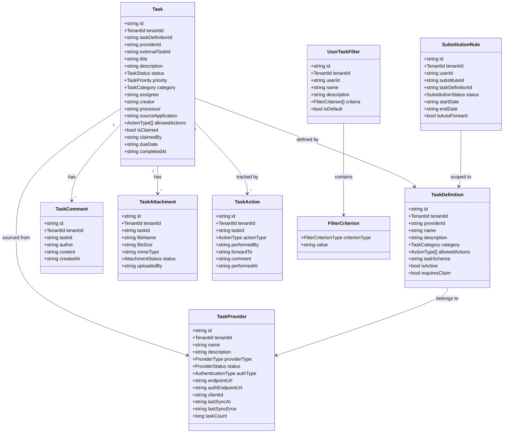
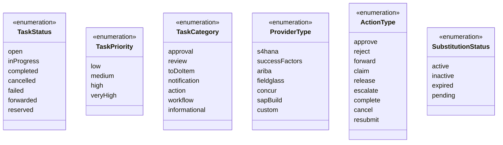
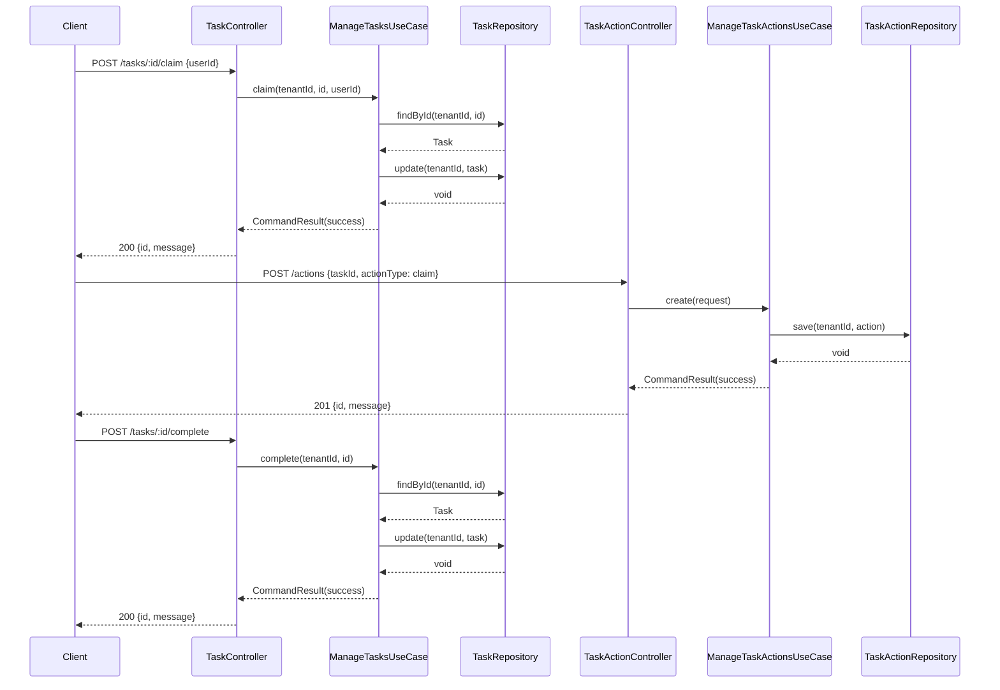
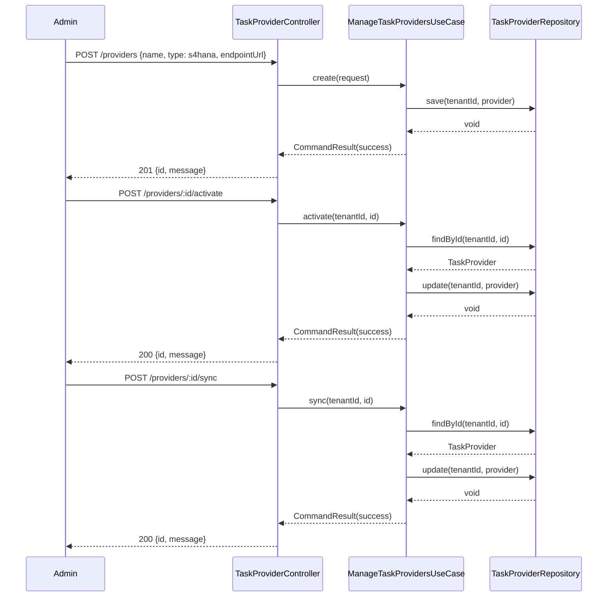
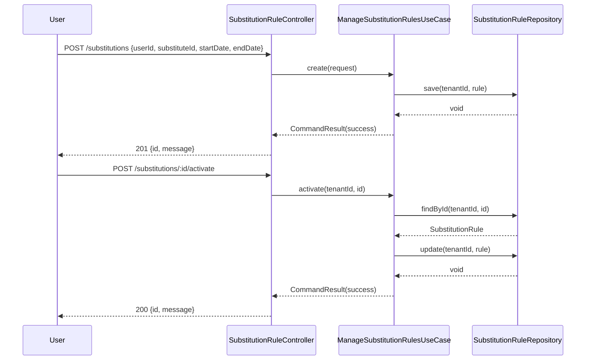
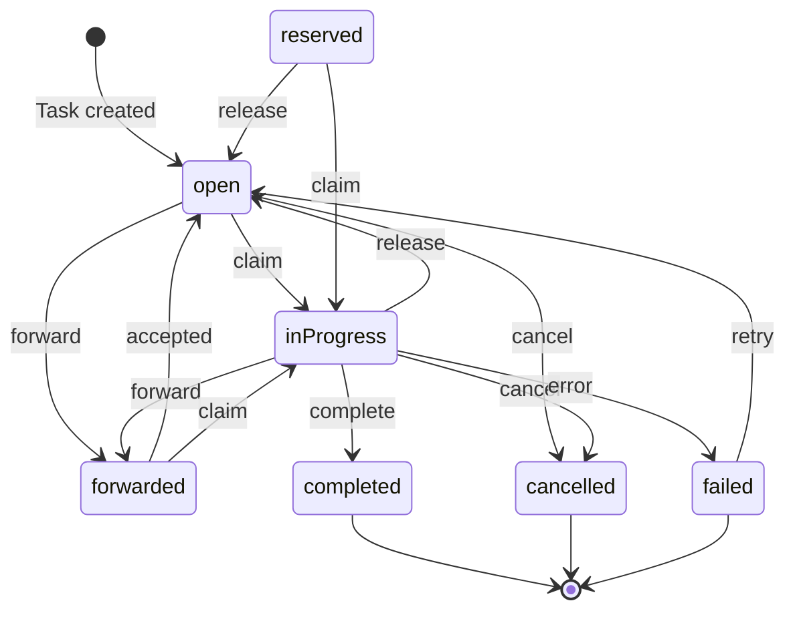
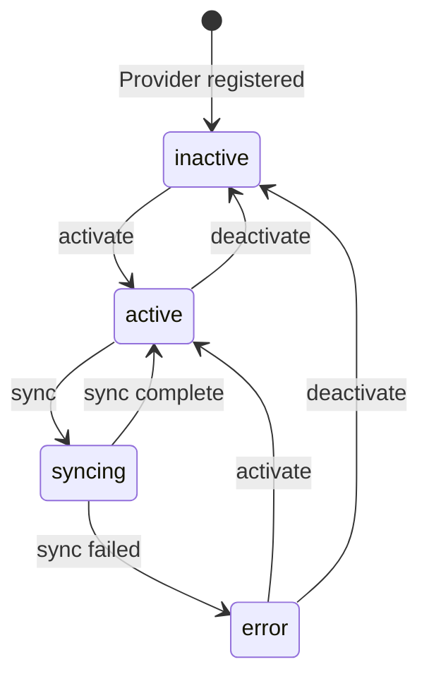
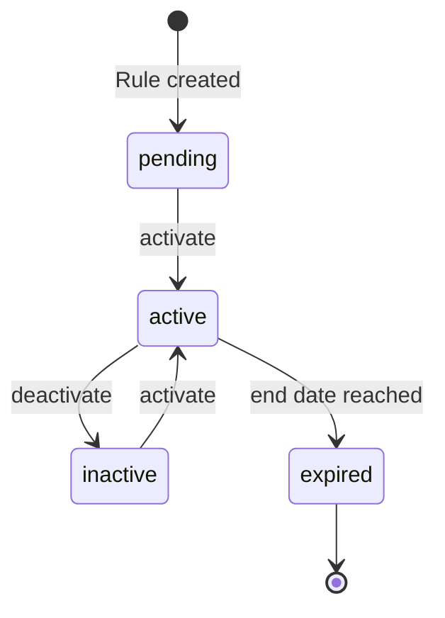

# Task Center Service - UML Diagrams

## Class Diagram - Domain Entities

## Class Diagram - Enumerations

## Sequence Diagram - Task Processing Flow

## Sequence Diagram - Task Federation (Provider Sync)

## Sequence Diagram - Substitution Management

## Component Diagram

```mermaid
graph TB
    subgraph "Presentation Layer"
        TC[TaskController]
        TDC[TaskDefinitionController]
        TPC[TaskProviderController]
        TCC[TaskCommentController]
        TAC[TaskAttachmentController]
        SRC[SubstitutionRuleController]
        TACC[TaskActionController]
        UFC[UserTaskFilterController]
        HC[HealthController]
    end

    subgraph "Application Layer"
        MTU[ManageTasksUseCase]
        MTDU[ManageTaskDefinitionsUseCase]
        MTPU[ManageTaskProvidersUseCase]
        MTCU[ManageTaskCommentsUseCase]
        MTAU[ManageTaskAttachmentsUseCase]
        MSRU[ManageSubstitutionRulesUseCase]
        MTACU[ManageTaskActionsUseCase]
        MUFU[ManageUserTaskFiltersUseCase]
    end

    subgraph "Domain Layer"
        TR[TaskRepository]
        TDR[TaskDefinitionRepository]
        TPR[TaskProviderRepository]
        TCR[TaskCommentRepository]
        TAR[TaskAttachmentRepository]
        SRR[SubstitutionRuleRepository]
        TACR[TaskActionRepository]
        UFR[UserTaskFilterRepository]
        TV[TaskValidator]
    end

    subgraph "Infrastructure Layer"
        MTR[MemoryTaskRepository]
        MTDR[MemoryTaskDefinitionRepository]
        MTPR[MemoryTaskProviderRepository]
        MTCR[MemoryTaskCommentRepository]
        MTAR[MemoryTaskAttachmentRepository]
        MSRR[MemorySubstitutionRuleRepository]
        MTACR[MemoryTaskActionRepository]
        MUFR[MemoryUserTaskFilterRepository]
        CFG[AppConfig]
        CNT[Container]
    end

    TC --> MTU
    TDC --> MTDU
    TPC --> MTPU
    TCC --> MTCU
    TAC --> MTAU
    SRC --> MSRU
    TACC --> MTACU
    UFC --> MUFU

    MTU --> TR
    MTDU --> TDR
    MTPU --> TPR
    MTCU --> TCR
    MTAU --> TAR
    MSRU --> SRR
    MTACU --> TACR
    MUFU --> UFR

    MTR -.-> TR
    MTDR -.-> TDR
    MTPR -.-> TPR
    MTCR -.-> TCR
    MTAR -.-> TAR
    MSRR -.-> SRR
    MTACR -.-> TACR
    MUFR -.-> UFR
```

## State Diagram - Task Lifecycle

## State Diagram - Provider Lifecycle

## State Diagram - Substitution Rule Lifecycle

