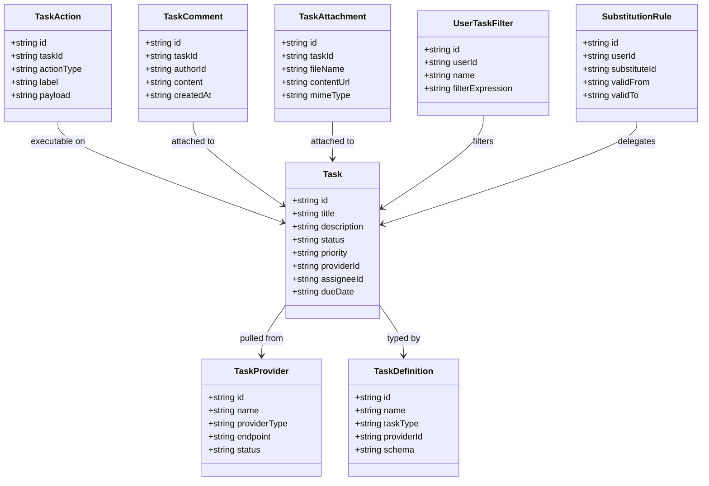
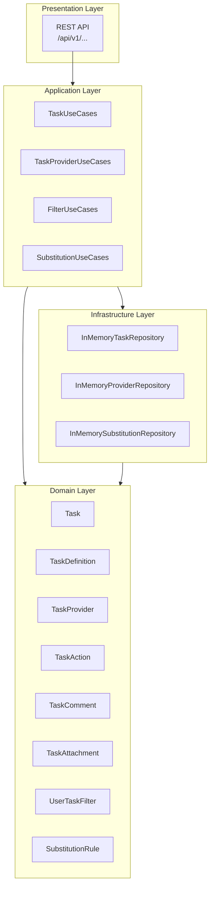
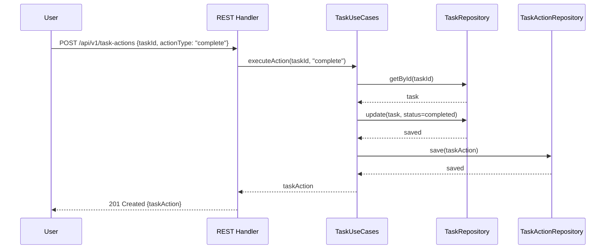

# UML Diagrams — Task Center Service

## Class Diagram

```mermaid
classDiagram
    class Task {
        +string id
        +string title
        +string description
        +string status
        +string priority
        +string providerId
        +string assigneeId
        +string dueDate
    }
    class TaskDefinition {
        +string id
        +string name
        +string taskType
        +string providerId
        +string schema
    }
    class TaskProvider {
        +string id
        +string name
        +string providerType
        +string endpoint
        +string status
    }
    class TaskAction {
        +string id
        +string taskId
        +string actionType
        +string label
        +string payload
    }
    class TaskComment {
        +string id
        +string taskId
        +string authorId
        +string content
        +string createdAt
    }
    class TaskAttachment {
        +string id
        +string taskId
        +string fileName
        +string contentUrl
        +string mimeType
    }
    class UserTaskFilter {
        +string id
        +string userId
        +string name
        +string filterExpression
    }
    class SubstitutionRule {
        +string id
        +string userId
        +string substituteId
        +string validFrom
        +string validTo
    }

    Task --> TaskProvider : pulled from
    Task --> TaskDefinition : typed by
    TaskAction --> Task : executable on
    TaskComment --> Task : attached to
    TaskAttachment --> Task : attached to
    UserTaskFilter --> Task : filters
    SubstitutionRule --> Task : delegates
```

## Component Diagram

```mermaid
flowchart TB
    subgraph Presentation["Presentation Layer"]
        REST["REST API\n/api/v1/..."]
    end
    subgraph Application["Application Layer"]
        TASK_UC["TaskUseCases"]
        PROVIDER_UC["TaskProviderUseCases"]
        FILTER_UC["FilterUseCases"]
        SUB_UC["SubstitutionUseCases"]
    end
    subgraph Domain["Domain Layer"]
        TASK["Task"]
        TD["TaskDefinition"]
        TP["TaskProvider"]
        TA["TaskAction"]
        TC["TaskComment"]
        TATT["TaskAttachment"]
        UTF["UserTaskFilter"]
        SR["SubstitutionRule"]
    end
    subgraph Infrastructure["Infrastructure Layer"]
        TASK_REPO["InMemoryTaskRepository"]
        TP_REPO["InMemoryProviderRepository"]
        SUB_REPO["InMemorySubstitutionRepository"]
    end

    REST --> Application
    Application --> Domain
    Infrastructure --> Domain
    Application --> Infrastructure
```

## Sequence Diagram — Complete Task

```mermaid
sequenceDiagram
    participant U as User
    participant R as REST Handler
    participant UC as TaskUseCases
    participant TR as TaskRepository
    participant ACT as TaskActionRepository

    U->>R: POST /api/v1/task-actions {taskId, actionType: "complete"}
    R->>UC: executeAction(taskId, "complete")
    UC->>TR: getById(taskId)
    TR-->>UC: task
    UC->>TR: update(task, status=completed)
    TR-->>UC: saved
    UC->>ACT: save(taskAction)
    ACT-->>UC: saved
    UC-->>R: taskAction
    R-->>U: 201 Created {taskAction}
```
