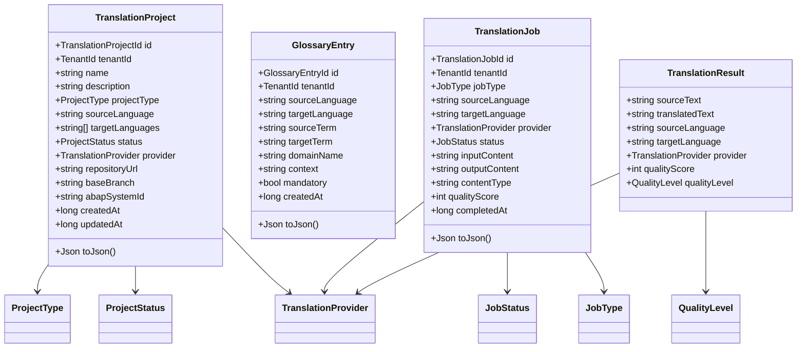
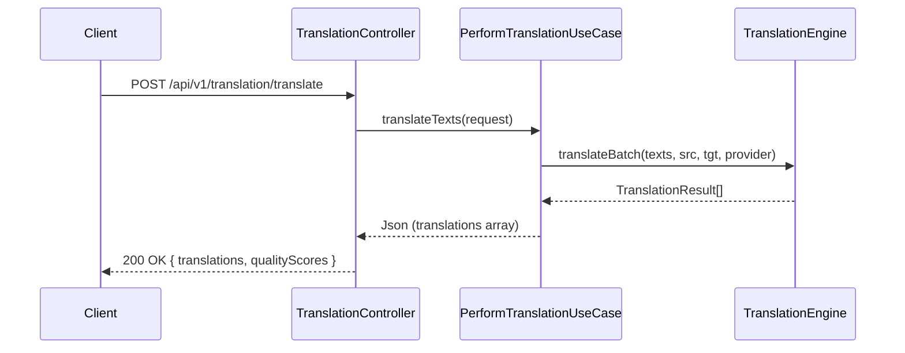
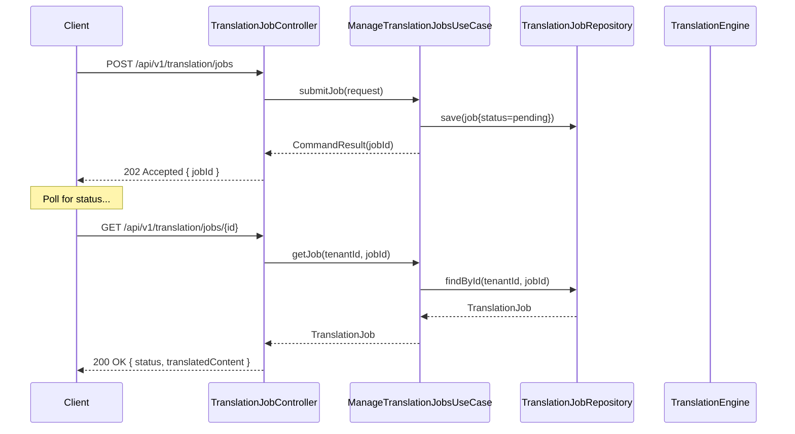
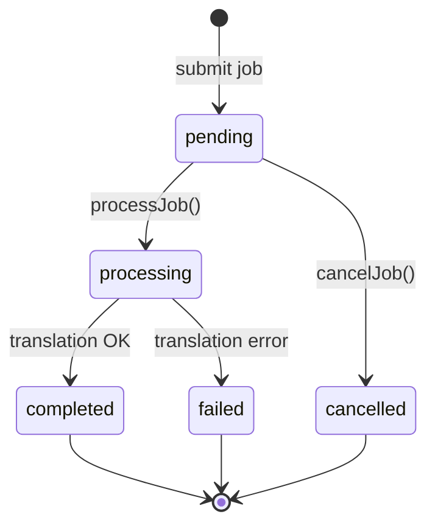
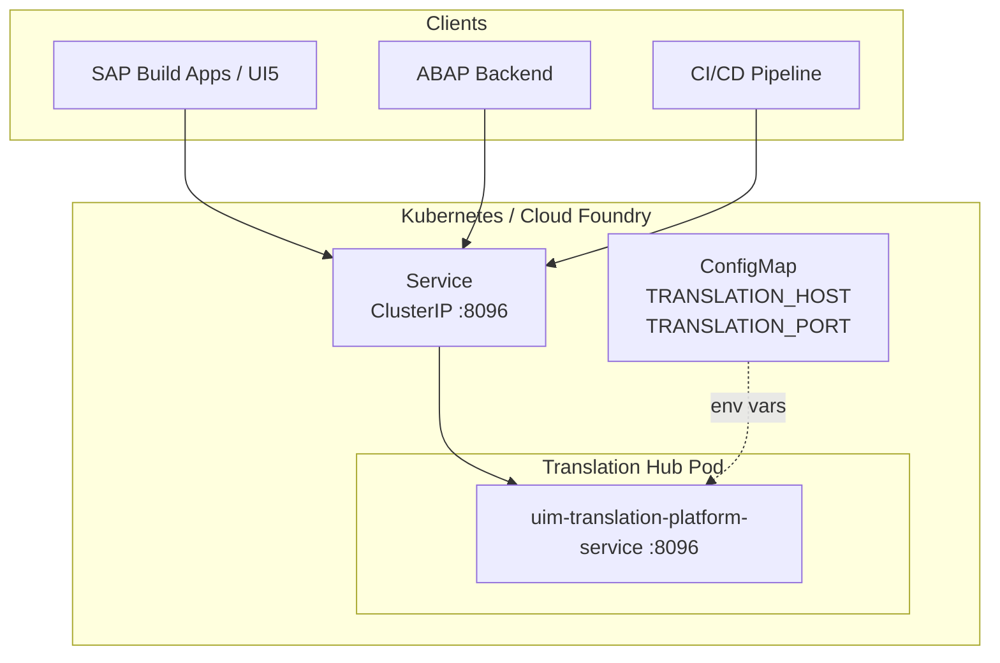

# UML — Translation Hub Service

## Class Diagram — Domain Entities

## Class Diagram — Hexagonal Architecture

```mermaid
classDiagram
    %% Domain
    class TranslationProjectRepository {
        <<interface>>
        +save(TranslationProject)
        +findById(TenantId, TranslationProjectId) TranslationProject
        +findByTenant(TenantId) TranslationProject[]
        +update(TranslationProject)
        +remove(TranslationProject)
    }
    class GlossaryEntryRepository {
        <<interface>>
        +save(GlossaryEntry)
        +findById(TenantId, GlossaryEntryId) GlossaryEntry
        +findByTenant(TenantId) GlossaryEntry[]
        +update(GlossaryEntry)
        +remove(GlossaryEntry)
    }
    class TranslationJobRepository {
        <<interface>>
        +save(TranslationJob)
        +findById(TenantId, TranslationJobId) TranslationJob
        +findByTenant(TenantId) TranslationJob[]
        +update(TranslationJob)
    }
    class TranslationEngine {
        +translate(text, srcLang, tgtLang, provider) TranslationResult
        +translateBatch(texts[], srcLang, tgtLang, provider) TranslationResult[]
        +supportsLanguagePair(src, tgt) bool
        +supportedLanguages() string[]
    }

    %% Application
    class ManageTranslationProjectsUseCase {
        +createProject(CreateTranslationProjectRequest) CommandResult
        +listProjects(TenantId) TranslationProject[]
        +getProject(TenantId, TranslationProjectId) TranslationProject
        +updateProject(UpdateTranslationProjectRequest) CommandResult
        +deleteProject(TenantId, TranslationProjectId) CommandResult
    }
    class ManageGlossaryEntriesUseCase {
        +createEntry(CreateGlossaryEntryRequest) CommandResult
        +listEntries(TenantId) GlossaryEntry[]
        +getEntry(TenantId, GlossaryEntryId) GlossaryEntry
        +updateEntry(UpdateGlossaryEntryRequest) CommandResult
        +deleteEntry(TenantId, GlossaryEntryId) CommandResult
    }
    class ManageTranslationJobsUseCase {
        +submitJob(SubmitTranslationJobRequest) CommandResult
        +processJob(TenantId, TranslationJobId) CommandResult
        +listJobs(TenantId) TranslationJob[]
        +getJob(TenantId, TranslationJobId) TranslationJob
        +cancelJob(TenantId, TranslationJobId) CommandResult
    }
    class PerformTranslationUseCase {
        +translateTexts(TranslateTextRequest) Json
        +translateDocument(TranslateDocumentRequest) Json
        +supportedLanguages() string[]
    }

    %% Infrastructure
    class MemoryTranslationProjectRepository {
        +existsByName(TenantId, string) bool
        +findByName(TenantId, string) TranslationProject
    }
    class MemoryGlossaryEntryRepository {
        +findByLanguagePair(TenantId, src, tgt) GlossaryEntry[]
        +findByDomain(TenantId, string) GlossaryEntry[]
    }
    class MemoryTranslationJobRepository {
        +findByStatus(TenantId, JobStatus) TranslationJob[]
        +findPending(TenantId) TranslationJob[]
    }

    %% Presentation
    class TranslationProjectController {
        +registerRoutes(URLRouter)
        +handleCreate(req, res)
        +handleList(req, res)
        +handleGet(req, res)
        +handleUpdate(req, res)
        +handleDelete(req, res)
    }
    class TranslationController {
        +registerRoutes(URLRouter)
        +handleTranslate(req, res)
    }
    class TranslationJobController {
        +registerRoutes(URLRouter)
        +handleSubmit(req, res)
        +handleList(req, res)
        +handleGet(req, res)
        +handleCancel(req, res)
    }

    ManageTranslationProjectsUseCase --> TranslationProjectRepository
    ManageGlossaryEntriesUseCase --> GlossaryEntryRepository
    ManageTranslationJobsUseCase --> TranslationJobRepository
    ManageTranslationJobsUseCase --> TranslationEngine
    PerformTranslationUseCase --> TranslationEngine
    MemoryTranslationProjectRepository ..|> TranslationProjectRepository
    MemoryGlossaryEntryRepository ..|> GlossaryEntryRepository
    MemoryTranslationJobRepository ..|> TranslationJobRepository
    TranslationProjectController --> ManageTranslationProjectsUseCase
    TranslationController --> PerformTranslationUseCase
    TranslationJobController --> ManageTranslationJobsUseCase
```

## Sequence Diagram — Synchronous Text Translation

## Sequence Diagram — Async Document Translation Job

## State Diagram — Translation Job Lifecycle

## Component Diagram — Deployment View

