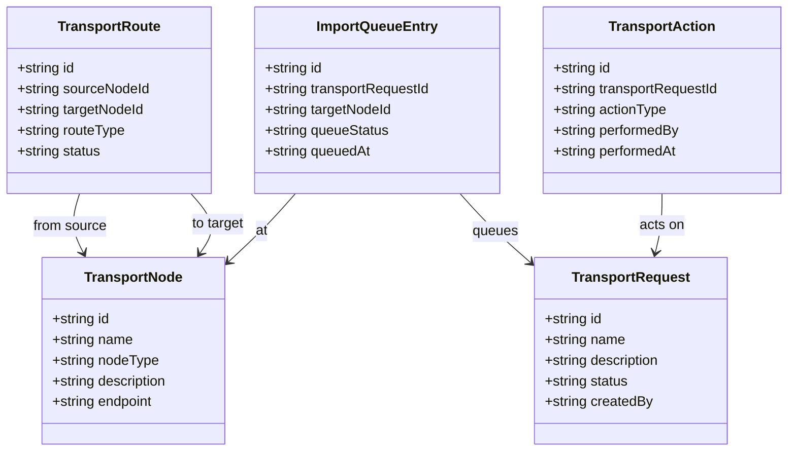
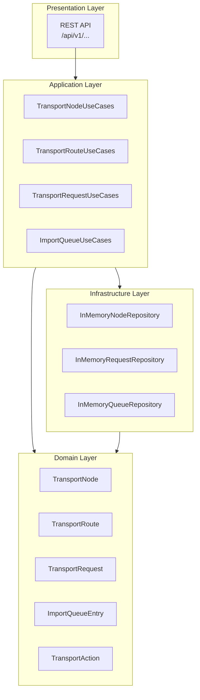
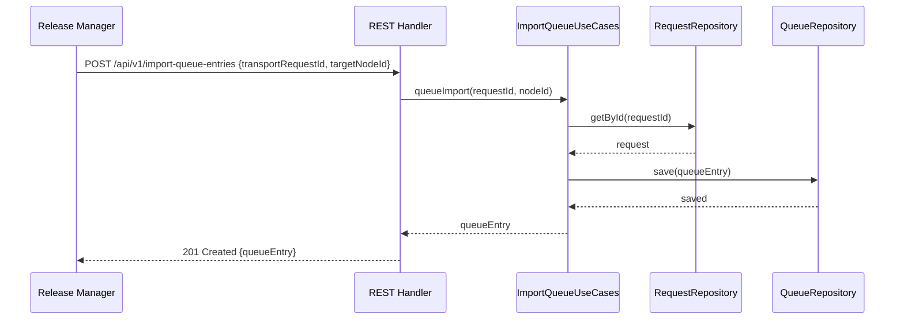

# UML Diagrams — Transport Service

## Class Diagram

```mermaid
classDiagram
    class TransportNode {
        +string id
        +string name
        +string nodeType
        +string description
        +string endpoint
    }
    class TransportRoute {
        +string id
        +string sourceNodeId
        +string targetNodeId
        +string routeType
        +string status
    }
    class TransportRequest {
        +string id
        +string name
        +string description
        +string status
        +string createdBy
    }
    class ImportQueueEntry {
        +string id
        +string transportRequestId
        +string targetNodeId
        +string queueStatus
        +string queuedAt
    }
    class TransportAction {
        +string id
        +string transportRequestId
        +string actionType
        +string performedBy
        +string performedAt
    }

    TransportRoute --> TransportNode : from source
    TransportRoute --> TransportNode : to target
    ImportQueueEntry --> TransportRequest : queues
    ImportQueueEntry --> TransportNode : at
    TransportAction --> TransportRequest : acts on
```

## Component Diagram

```mermaid
flowchart TB
    subgraph Presentation["Presentation Layer"]
        REST["REST API\n/api/v1/..."]
    end
    subgraph Application["Application Layer"]
        NODE_UC["TransportNodeUseCases"]
        ROUTE_UC["TransportRouteUseCases"]
        REQ_UC["TransportRequestUseCases"]
        IQ_UC["ImportQueueUseCases"]
    end
    subgraph Domain["Domain Layer"]
        NODE["TransportNode"]
        ROUTE["TransportRoute"]
        REQ["TransportRequest"]
        IQE["ImportQueueEntry"]
        ACTION["TransportAction"]
    end
    subgraph Infrastructure["Infrastructure Layer"]
        NODE_REPO["InMemoryNodeRepository"]
        REQ_REPO["InMemoryRequestRepository"]
        IQ_REPO["InMemoryQueueRepository"]
    end

    REST --> Application
    Application --> Domain
    Infrastructure --> Domain
    Application --> Infrastructure
```

## Sequence Diagram — Trigger Import

```mermaid
sequenceDiagram
    participant R as Release Manager
    participant H as REST Handler
    participant UC as ImportQueueUseCases
    participant RQR as RequestRepository
    participant IQR as QueueRepository

    R->>H: POST /api/v1/import-queue-entries {transportRequestId, targetNodeId}
    H->>UC: queueImport(requestId, nodeId)
    UC->>RQR: getById(requestId)
    RQR-->>UC: request
    UC->>IQR: save(queueEntry)
    IQR-->>UC: saved
    UC-->>H: queueEntry
    H-->>R: 201 Created {queueEntry}
```
